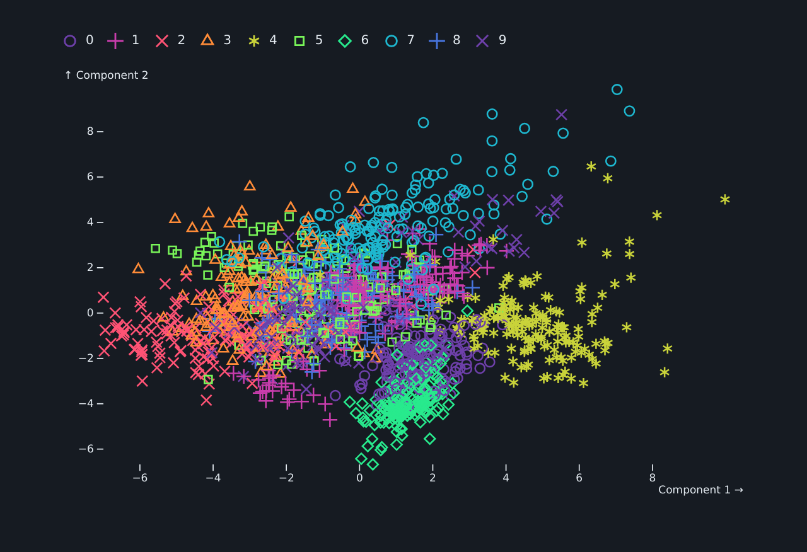

<p align="center">
    </img>
</p>

detroit is wrapper for Python of [d3js](https://d3js.org/) and [Observable Plot](https://observablehq.com/plot/).

# Installation

```sh
pip install detroit
```

Then you will need to install a browser through the Python package `playwright`.
For the moment, only `chromium` is supported.

```sh
playwright install chromium
```

# Features

- Write as close as possible `d3` and `Plot` code
- Render one or multiple plots in your browser or in your jupyter notebook
- Customize style as you want
- Save them into `.svg`, `.png` or `.pdf`

# Quick Example


```py
import polars as pl
from sklearn.datasets import load_digits
from sklearn.decomposition import PCA
from sklearn.preprocessing import StandardScaler

from detroit import Plot, js, render, save

mnsit = load_digits()
scaler = StandardScaler()
X_scaled = scaler.fit_transform(mnsit.data)
pca = PCA(n_components=2)
components = pca.fit_transform(X_scaled)

# Prepare your data with Polars, Pandas or manually
df = pl.DataFrame(components, schema=["Component 1", "Component 2"])
df = df.insert_column(2, pl.Series("digit", mnsit.target))

plot = Plot.plot({
  "style": {"backgroundColor": "#161b22", "color": "#e6edf3"},
  "symbol": {"legend": js("true")},
  "color": {"scheme": "rainbow"},
  "marks": [
      Plot.dot(js("data"), {
          "x": "Component 1",
          "y": "Component 2",
          "stroke": "digit",
          "symbol": "digit"
      })
  ]
})

render(df, plot, style={"body": {"background": "#161b22", "color": "#e6edf3"}})
```


