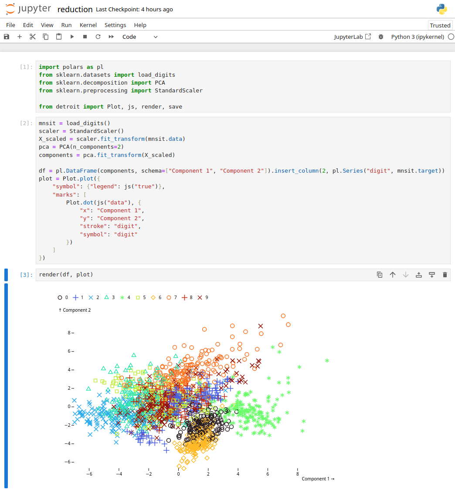

# detroit

detroit is wrapper for Python of [d3js](https://d3js.org/) especially focus on [Observable Plot](https://observablehq.com/plot/) in the current version.

## Installation

```shell
pip install git+https://github.com/bourbonut/detroit.git
```
Then you will need to install a browser through the Python package `playwright`. For the moment, only `chromium` is supported.
```shell
playwright install chromium
```

## Features

- Render in your browser a plot
- Save your plot to `.png`, `.svg` or `.pdf`
- Support `pandas` and `polars` dataframes
- Support `jupyter` notebook

**Note :** `.svg` does not support the legend. However, `.png` and `.pdf` support it !

## Usage

- Render a plot in `jupyter` notebook



- Render a plot in your browser

```py
import polars as pl
from sklearn.datasets import load_digits
from sklearn.decomposition import PCA
from sklearn.preprocessing import StandardScaler

from detroit import Plot, js, render, save, style, Theme

mnsit = load_digits()
scaler = StandardScaler()
X_scaled = scaler.fit_transform(mnsit.data)
pca = PCA(n_components=2)
components = pca.fit_transform(X_scaled)

# You can choose a theme or keep default colors
theme = style(Theme.DARK) # or Theme.JUPYTER_DARK, Theme.JUPYTER_DARK_CENTER

df = pl.DataFrame(components, schema=["Component 1", "Component 2"]).insert_column(2, pl.Series("digit", mnsit.target))
plot = Plot.plot({
    "style": theme.plot,              # change colors of plot div precisely
    "symbol": {"legend": js("true")},
    "marks": [
        Plot.dot(js("data"), {
            "x": "Component 1",
            "y": "Component 2",
            "stroke": "digit",
            "symbol": "digit"
        })
    ]
})

render(df, plot, style=theme.body) # change background color and text color
```

Then type in your browser `localhost:5000` to view your plot

**Note :** You can also write your own style if you want :
```py
plot = Plot.plot({
    "style": {"backgroundColor": "#111111", "color": "white"}, # check plot documentation
    "symbol": {"legend": js("true")},
    "marks": [
        Plot.dot(js("data"), {
            "x": "Component 1",
            "y": "Component 2",
            "stroke": "digit",
            "symbol": "digit"
        })
    ]
})

style = """
body {
    background: #111111;
    color: white;
    display: flex;
    justify-content: center;
}
"""
render(df, plot, style=style)
# Or save it in a file and load it
render(df, plot, style="style.css")
```

- Save your figure as `.svg`, `.png` or `.pdf`

```py
# Replace
render(df, plot)
# By
save(df, plot, "figure.pdf")
save(df, plot, "figure.svg")
save(df, plot, "figure.png", scale_factor=2, width=640, height=440)
```

**Note :** `.svg` does not support the legend. However, `.png` and `.pdf` support it !
