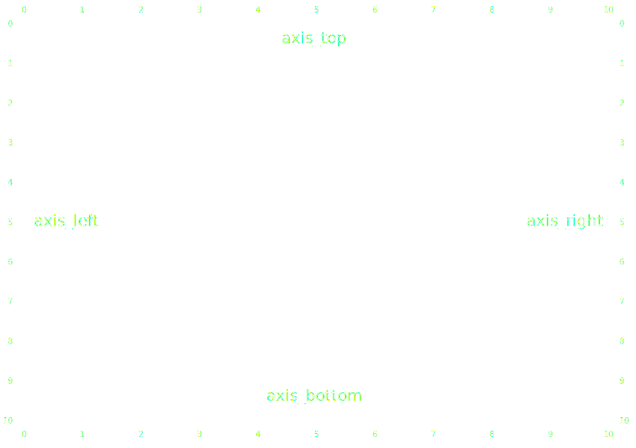

Axis
====

.. autofunction:: detroit.axis_top
.. autofunction:: detroit.axis_left
.. autofunction:: detroit.axis_right
.. autofunction:: detroit.axis_bottom

.. autoclass:: detroit.axis.axis.Axis

   .. automethod:: __call__
   .. automethod:: set_ticks
   .. automethod:: set_tick_arguments
   .. automethod:: set_tick_values
   .. automethod:: set_tick_format
   .. automethod:: set_tick_size
   .. automethod:: set_tick_size_inner
   .. automethod:: set_tick_size_outer
   .. automethod:: set_tick_padding
   .. automethod:: set_offset
