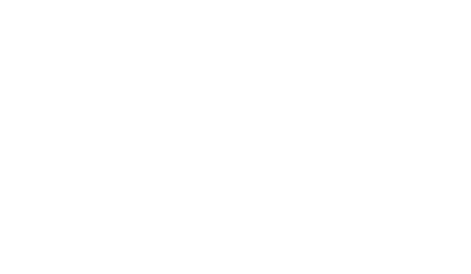
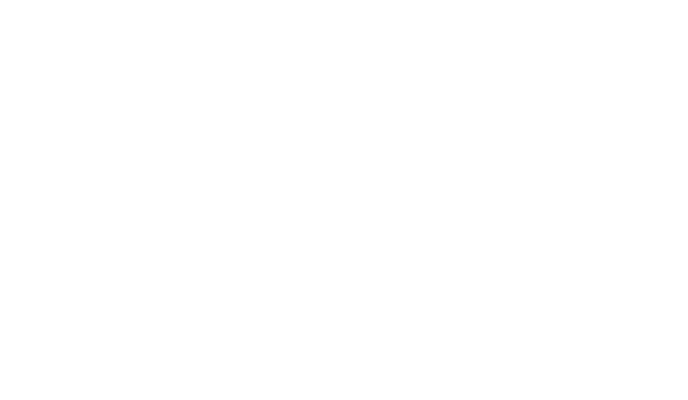
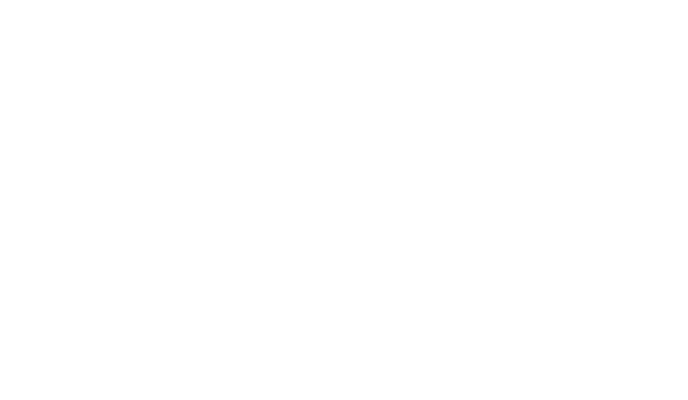
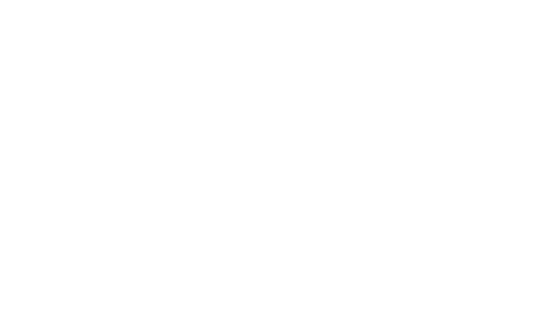

Azimuthal projections
=====================

.. autofunction:: detroit.geo_azimuthal_equal_area

.. autofunction:: detroit.geo_azimuthal_equidistant

.. autofunction:: detroit.geo_gnomonic

.. autofunction:: detroit.geo_orthographic

.. image:: ../../../figures/light-projection-orthographic.png
   :align: center
   :class: only-light

.. autofunction:: detroit.geo_stereographic

