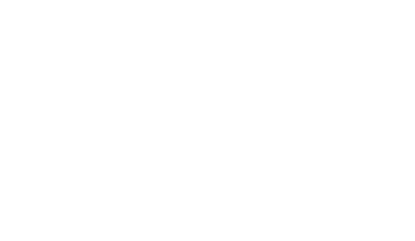
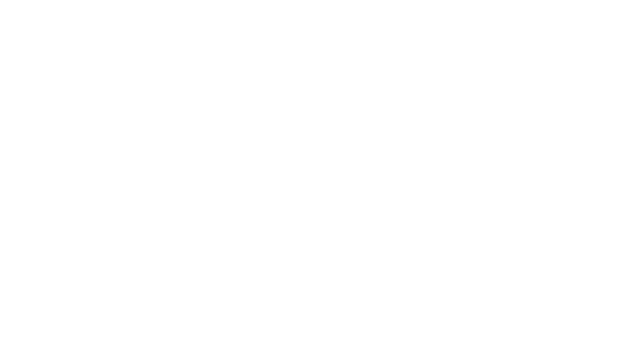
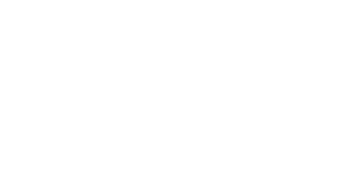

Conic projections
=================

.. autofunction:: detroit.geo_conic_conformal

.. image:: ../../../figures/dark-projection-conic_conformal.png
   :align: center
   :class: only-dark

.. autofunction:: detroit.geo_conic_equal_area

.. image:: ../../../figures/dark-projection-conic_equal_area.png
   :align: center
   :class: only-dark

.. autofunction:: detroit.geo_conic_equidistant

.. autofunction:: detroit.geo_albers

.. autofunction:: detroit.geo_albers_usa

