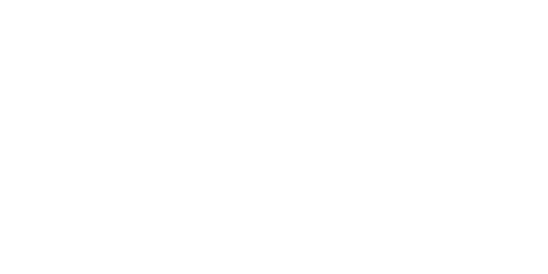
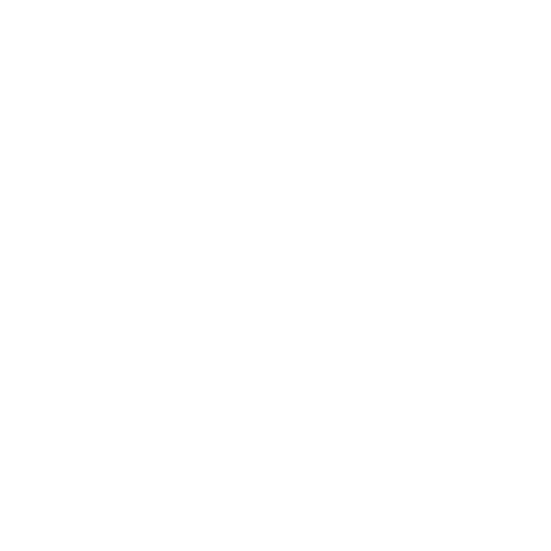
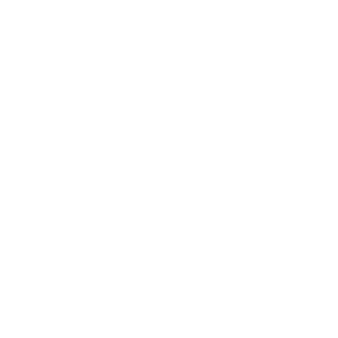
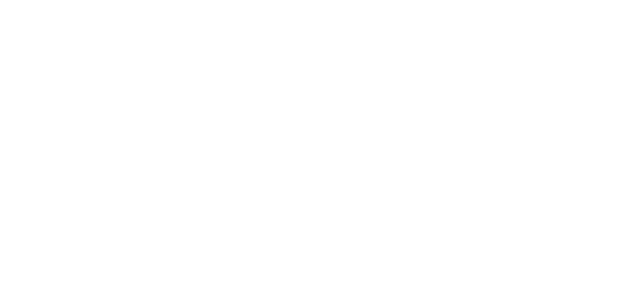
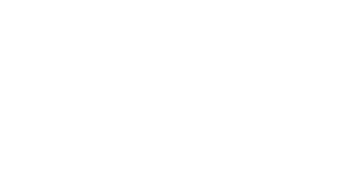

Cylindrical projections
=======================

.. autofunction:: detroit.geo_equirectangular

.. autofunction:: detroit.geo_mercator

.. autofunction:: detroit.geo_transverse_mercator

.. autofunction:: detroit.geo_equal_earth

.. autofunction:: detroit.geo_natural_earth_1

