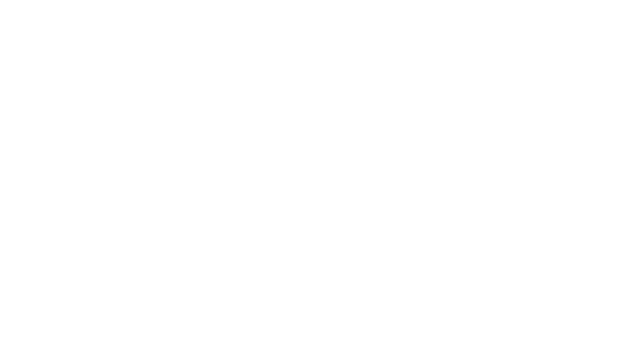

Spherical shapes
================

Graticule
---------

.. image:: ../../figures/light-graticule.svg
   :align: center
   :class: only-light

.. autofunction:: detroit.geo_graticule
.. autofunction:: detroit.geo_graticule_10

.. autoclass:: detroit.geo.graticule.Graticule

   .. automethod:: __call__
   .. automethod:: lines
   .. automethod:: outline
   .. automethod:: set_extent
   .. automethod:: set_extent_major
   .. automethod:: set_extent_minor
   .. automethod:: set_step
   .. automethod:: set_step_major
   .. automethod:: set_step_minor
   .. automethod:: set_precision

Circle
------

.. autofunction:: detroit.geo_circle

.. autoclass:: detroit.geo.circle.GeoCircle

   .. automethod:: __call__
   .. automethod:: set_center
   .. automethod:: set_radius
   .. automethod:: set_precision
