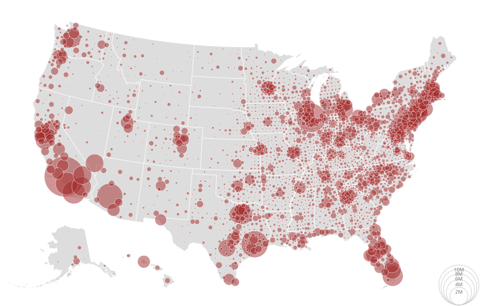

Geographical Map
================

1. Load data

.. code:: python

   # https://observablehq.com/@d3/bubble-map/2
   import detroit as d3
   import requests
   import json
   from pytopojson.feature import Feature
   from math import isnan

   URL = "https://static.observableusercontent.com/files/beb56a2d9534662123fa352ffff2db8472e481776fcc1608ee4adbd532ea9ccf2f1decc004d57adc76735478ee68c0fd18931ba01fc859ee4901deb1bee2ed1b?response-content-disposition=attachment%3Bfilename*%3DUTF-8%27%27population.json"
   US_URL = "https://cdn.jsdelivr.net/npm/us-atlas@3/counties-10m.json"

   # Load data
   population = json.loads(requests.get(URL).content)
   us = json.loads(requests.get(US_URL).content)
   nation = Feature()(us, us["objects"]["nation"])
   statemap = dict(
       (d["id"], d) for d in Feature()(us, us["objects"]["states"])["features"]
   )
   countymap = dict(
       (d["id"], d) for d in Feature()(us, us["objects"]["counties"])["features"]
   )
   statemesh = json.load(open("data/statemesh.json"))
   countymesh = json.load(open("data/countymesh.json"))

   # Declare the chart dimensions.
   width = 975
   height = 610

   projection = (
       d3.geo_albers_usa().scale(width * 1.2).translate([width * 0.5, height * 0.5])
   )

   # Helps to compute centroid positions
   class Centroid:
       def __init__(self):
           self._centroid = d3.geo_path(projection).centroid

       def __call__(self, feature):
           return f"translate({','.join(map(str, self._centroid(feature)))})"

       def is_valid(self, feature):
           return not any(map(isnan, self._centroid(feature)))

   centroid = Centroid()

   # Process data
   population = [
       {
           "state": statemap.get(state),
           "county": countymap.get(f"{state}{county}"),
           "fips": f"{state}{county}",
           "population": int(p),
       }
       for p, state, county in population[1:]
   ]
   data = sorted(
       filter(lambda d: centroid.is_valid(d["county"]), population),
       key=lambda d: d["population"],
       reverse=True,
   )

2. Make the map

.. code:: python

   # Declare the radius scale.
   radius = d3.scale_sqrt([0, data[0]["population"]], [0, 40])
   path = d3.geo_path(projection)

   # Create the SVG container.
   svg = (
       d3.create("svg")
       .attr("width", width)
       .attr("height", height)
       .attr("viewBox", f"0 0 {width} {height}")
       .attr("style", "width:100%;height:auto;")
   )

   # Append US nations
   svg.append("path").datum(nation).attr("fill", "#ddd").attr("d", path)

   # Append borderlands of states
   (
       svg.append("path")
       .datum(statemesh)
       .attr("fill", "none")
       .attr("stroke", "white")
       .attr("stroke-linejoin", "round")
       .attr("d", path)
   )

   # Append legend
   legend = (
       svg.append("g")
       .attr("fill", "#777")
       .attr("transform", "translate(915,608)")
       .attr("text-anchor", "middle")
       .style("font", "10px sans-serif")
       .select_all()
       .data(radius.ticks(4)[1:])
       .join("g")
   )

   # Append circles in legend
   (
       legend.append("circle")
       .attr("fill", "none")
       .attr("stroke", "#ccc")
       .attr("cy", lambda d: -radius(d))
       .attr("r", radius)
   )

   # Append texts in legend
   (
       legend.append("text")
       .attr("y", lambda d: -2 * radius(d))
       .attr("dy", "1.3em")
       .text(radius.tick_format(4, "s"))
   )

   # Append red circles and description when the mouse overs a red circle (only
   # available on SVG)
   formatter = d3.format(",.0f")
   (
       svg.append("g")
       .attr("fill", "brown")
       .attr("fill-opacity", 0.5)
       .attr("stroke", "white")
       .attr("stroke-width", 0.5)
       .select_all()
       .data(data)
       .join("circle")
       .attr("transform", lambda d: centroid(d["county"]))
       .attr("r", lambda d: radius(d['population']))
       .append("title")
       .text(lambda d: f"{d['county']['properties']['name']}, {d['state']['properties']['name']} {formatter(d['population'])}")
   )

3. Save your chart

.. code:: python

   with open(f"bubble-map.svg", "w") as file:
       file.write(str(svg))
