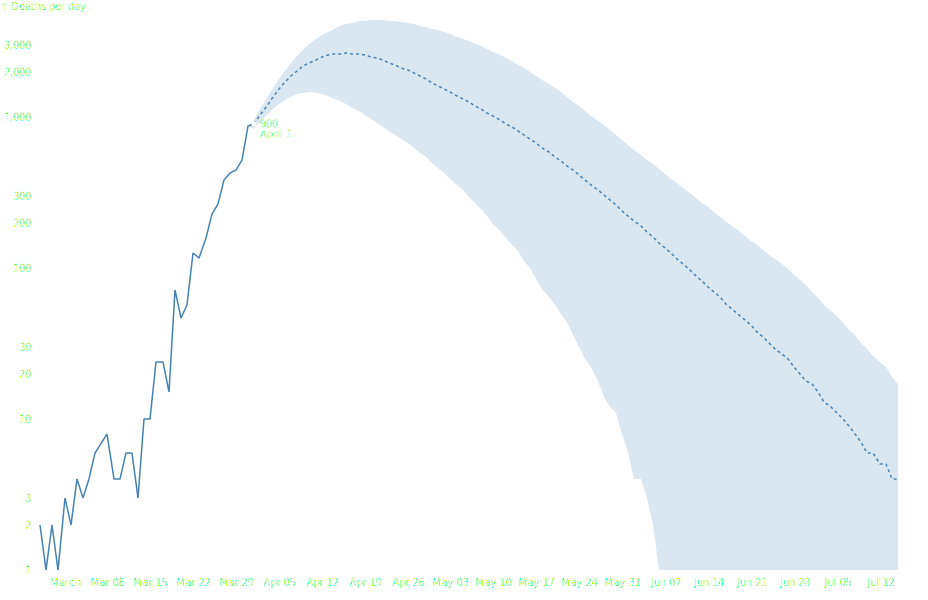

Fan Chart
=========

.. image:: ../figures/light-fan-chart.svg
   :align: center
   :class: only-light

1. Load data

.. code:: python

   # Source: https://observablehq.com/@d3/fan-chart
   import detroit as d3
   import polars as pl
   from collections import namedtuple

   URL = "https://static.observableusercontent.com/files/56bfb0d9ffc42b5c82ab7c52e91694ff266585ff9835cd292b910054e857577e5ff5b49231a0b91d8370608cb5bd213590b7468e794c8760349cf234d35a1c8a?response-content-disposition=attachment%3Bfilename*%3DUTF-8%27%27covid-ihme-projected-deaths-2020-04-01.csv"
   Margin = namedtuple("Margin", ("top", "right", "bottom", "left"))

   covid_data = pl.read_csv(URL).select(
       pl.col("date").str.to_datetime("%Y-%m-%d"),
       pl.all().exclude("date"),
   )

   data = covid_data.to_dicts()
   observed_index = 0
   while not data[observed_index]["projected"]:
       observed_index += 1
   observed_index -= 1
   observed = data[observed_index]

.. code::

   shape: (140, 5)
   ┌─────────────────────┬───────────┬──────┬───────┬───────┐
   │ date                ┆ projected ┆ mean ┆ upper ┆ lower │
   │ ---                 ┆ ---       ┆ ---  ┆ ---   ┆ ---   │
   │ datetime[μs]        ┆ bool      ┆ i64  ┆ i64   ┆ i64   │
   ╞═════════════════════╪═══════════╪══════╪═══════╪═══════╡
   │ 2020-02-26 00:00:00 ┆ false     ┆ 2    ┆ 2     ┆ 2     │
   │ 2020-02-27 00:00:00 ┆ false     ┆ 1    ┆ 1     ┆ 1     │
   │ 2020-02-28 00:00:00 ┆ false     ┆ 2    ┆ 2     ┆ 2     │
   │ 2020-02-29 00:00:00 ┆ false     ┆ 1    ┆ 1     ┆ 1     │
   │ 2020-03-01 00:00:00 ┆ false     ┆ 3    ┆ 3     ┆ 3     │
   │ …                   ┆ …         ┆ …    ┆ …     ┆ …     │
   │ 2020-07-11 00:00:00 ┆ true      ┆ 6    ┆ 26    ┆ 0     │
   │ 2020-07-12 00:00:00 ┆ true      ┆ 5    ┆ 24    ┆ 0     │
   │ 2020-07-13 00:00:00 ┆ true      ┆ 5    ┆ 22    ┆ 0     │
   │ 2020-07-14 00:00:00 ┆ true      ┆ 4    ┆ 19    ┆ 0     │
   │ 2020-07-15 00:00:00 ┆ true      ┆ 4    ┆ 17    ┆ 0     │
   └─────────────────────┴───────────┴──────┴───────┴───────┘

2. Make the fan chart

.. code:: python

   # Declare the chart dimensions and margins.
   width = 928
   height = 600
   margin = Margin(20, 30, 30, 40)
   
   # Declare the x (horizontal position) scale.
   x = (
       d3.scale_time()
       .set_domain(d3.extent(data, lambda d: d["date"]))
       .set_range_round([margin.left, width - margin.right])
   )
   
   # Declare the y (vertical position) scale.
   y = (
       d3.scale_log()
       .set_domain([1, max(map(lambda d: d["upper"], data))])
       .set_range_round([height - margin.bottom, margin.top])
       .set_clamp(True)
   )
   
   # Declare the line generator.
   line = d3.line().x(lambda d: x(d["date"])).y(lambda d: y(d["mean"]))
   
   # Declare the area generator.
   area = (
       d3.area()
       .x(lambda d: x(d["date"]))
       .y(lambda d: y(d["lower"]))
       .y1(lambda d: y(d["upper"]))
   )
   
   # Grid function (passed to `svg.call(...)`).
   def grid(g):
       def horizontal_lines(g):
           (
               g.append("g")
               .select_all("line")
               .data(x.ticks())
               .join("line")
               .attr("x1", lambda d: 0.5 + x(d))
               .attr("x2", lambda d: 0.5 + x(d))
               .attr("y1", margin.top)
               .attr("y2", height - margin.bottom)
           )
   
       def vertical_lines(g):
           (
               g.append("g")
               .select_all("line")
               .data(y.ticks())
               .join("line")
               .attr("y1", lambda d: 0.5 + y(d))
               .attr("y2", lambda d: 0.5 + y(d))
               .attr("x1", margin.left)
               .attr("x2", width - margin.right)
           )
   
       (
           g.attr("stroke", "black")
           .attr("stroke-opacity", 0.1)
           .call(horizontal_lines)
           .call(vertical_lines)
       )
   
   
   # X-axis function (passed to `svg.call(...)`)
   def x_axis(g):
       (
           g.attr("transform", f"translate(0, {height - margin.bottom})")
           .call(d3.axis_bottom(x).set_ticks(width / 80))
           .call(lambda g: g.select(".domain").remove())
       )
   
   
   # Y-axis function (passed to `svg.call(...)`)
   def y_axis(g):
       (
           g.attr("transform", f"translate({margin.left}, 0)")
           .call(d3.axis_left(y).set_ticks(None, ",d"))
           .call(lambda g: g.select(".domain").remove())
           .call(
               lambda g: (
                   g.append("text")
                   .attr("x", -margin.left)
                   .attr("y", 10)
                   .attr("fill", "black")
                   .attr("text-anchor", "start")
                   .text("↑ Deaths per day")
               )
           )
       )
   
   
   # Create the SVG container.
   svg = (
       d3.create("svg")
       .attr("width", width)
       .attr("height", height)
       .attr("viewBox", [0, 0, width, height])
       .attr("font-family", "sans-serif")
       .attr("font-size", 10)
       .attr("stroke-miterlimit", 1)
   )
   
   # Add the x-axis.
   svg.append("g").call(x_axis)
   
   # Add the y-axis.
   svg.append("g").call(y_axis)
   
   # Add grid.
   svg.append("g").call(grid)
   
   
   # Append a path for the area.
   (
       svg.append("path")
       .attr("fill", "steelblue")
       .attr("fill-opacity", 0.2)
       .attr("d", area(data))
   )
   
   # Append a path for the line (left part).
   (
       svg.append("path")
       .attr("fill", "none")
       .attr("stroke", "steelblue")
       .attr("stroke-width", 1.5)
       .attr("d", line(data[0 : observed_index + 1]))
   )
   
   # Append a path for the line (right part).
   (
       svg.append("path")
       .attr("fill", "none")
       .attr("stroke", "steelblue")
       .attr("stroke-width", 1.5)
       .attr("stroke-dasharray", "3,3")
       .attr("d", line(data[observed_index:]))
   )
   
   # Append a circle for the observed mean.
   (
       svg.append("circle")
       .attr("cx", x(observed["date"]))
       .attr("cy", y(observed["mean"]))
       .attr("r", 2.5)
       .attr("fill", "black")
   )
   
   # Append the mean value of the observed mean as text.
   (
       svg.append("text")
       .attr("x", x(observed["date"]))
       .attr("y", y(observed["mean"]))
       .attr("dx", 6)
       .attr("dy", "0.35em")
       .text(str(observed["mean"]))
   )
   
   # Append the date value of the observed mean as text.
   (
       svg.append("text")
       .attr("x", x(observed["date"]))
       .attr("y", y(observed["mean"]))
       .attr("dx", 6)
       .attr("dy", "1.35em")
       .text(observed["date"].strftime("%B %-d"))
   )

3. Save your chart

.. code:: python

   with open(f"fan-chart.svg", "w") as file:
       file.write(str(svg))
