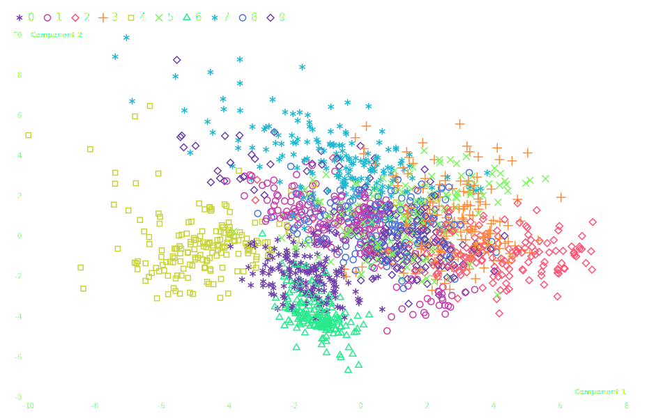

Principal Component Analysis on MNIST dataset
=============================================

.. image:: ../figures/light-pca.svg
   :align: center
   :class: only-light

1. Load data

.. code:: python

   # pip install scikit-learn
   import detroit as d3
   import polars as pl # for data manipulation
   from collections import namedtuple
   from sklearn.datasets import load_digits # for MNIST dataset
   from sklearn.decomposition import PCA # PCA decomposition
   from sklearn.preprocessing import StandardScaler # To normalize data

   # Prepare data
   mnist = load_digits() # load data
   scaler = StandardScaler() # initialize scaler
   X_scaled = scaler.fit_transform(mnist.data) # update scaler and normalize data
   pca = PCA(n_components=2) # initialize PCA decomposition
   components = pca.fit_transform(X_scaled) # update PCA and transform data

   df = pl.DataFrame(components, schema=["Component 1", "Component 2"])
   df = df.insert_column(2, pl.Series("digit", mnist.target)) # add digit as "Z-axis" for color

.. code::

   shape: (1_797, 3)
   ┌─────────────┬─────────────┬───────┐
   │ Component 1 ┆ Component 2 ┆ digit │
   │ ---         ┆ ---         ┆ ---   │
   │ f64         ┆ f64         ┆ i64   │
   ╞═════════════╪═════════════╪═══════╡
   │ 1.914217    ┆ -0.954454   ┆ 0     │
   │ 0.58898     ┆ 0.924555    ┆ 1     │
   │ 1.302033    ┆ -0.317105   ┆ 2     │
   │ -3.02077    ┆ -0.868772   ┆ 3     │
   │ 4.528946    ┆ -1.093314   ┆ 4     │
   │ …           ┆ …           ┆ …     │
   │ 0.104338    ┆ 0.254933    ┆ 9     │
   │ 2.423241    ┆ -1.429641   ┆ 0     │
   │ 1.022598    ┆ -0.148016   ┆ 8     │
   │ 1.076056    ┆ -0.380974   ┆ 9     │
   │ -1.257696   ┆ -2.227632   ┆ 8     │
   └─────────────┴─────────────┴───────┘

2. Make the PCA chart

.. code:: python

   # Specify the chart's dimensions
   width = 928
   height = 600

   Margin = namedtuple("Margin", ["top", "right", "bottom", "left"])
   margin = Margin(50, 30, 30, 40)

   # Create the horizontal x scale
   x = (
       d3.scale_linear()
       .set_domain([df["Component 1"].min(), df["Component 1"].max()])
       .nice()
       .set_range([margin.left, width - margin.right])
   )

   # Create the vertical y scale
   y = (
       d3.scale_linear()
       .set_domain([df["Component 2"].min(), df["Component 2"].max()])
       .nice()
       .set_range([height - margin.bottom, margin.top])
   )

   svg = (
       d3.create("svg")
       .attr("width", width)
       .attr("height", height)
       .attr("viewBox", f"0 0 {width} {height}")
   )

   # Append the axis

   (
       svg.append("g")
       .attr("transform", f"translate(0, {height - margin.bottom})")
       .call(d3.axis_bottom(x))
       .call(lambda g: g.select(".domain").remove())
       .call(
           lambda g: g.append("text")
           .attr("x", width - margin.right)
           .attr("y", -4)
           .attr("fill", "#000")
           .attr("font-weight", "bold")
           .attr("text-anchor", "end")
           .text("Component 1")
       )
   )

   (
       svg.append("g")
       .attr("transform", f"translate({margin.left}, 0)")
       .call(d3.axis_left(y))
       .call(lambda g: g.select(".domain").remove())
       .call(
           lambda g: g.select(".tick:last-of-type")
           .select("text")
           .clone()
           .attr("x", 4)
           .attr("text-anchor", "start")
           .attr("font-weight", "bold")
           .text("Component 2")
       )
   )

   # Append the symbols

   symbol_type = d3.scale_ordinal(df["digit"].unique().sort().to_list(), d3.SYMBOLS_STROKE)

   color = d3.scale_sequential(
       [df["digit"].min(), df["digit"].max()], d3.interpolate_rainbow
   )

   (
       svg.append("g")
       .attr("fill", "none")
       .attr("stroke-width", 1.5)
       .select_all("symbol")
       .data(df.iter_rows())
       .join("g")
       .attr("transform", lambda d: f"translate({x(d[0])}, {y(d[1])})")
       .append("path")
       .attr("d", lambda d: d3.symbol(symbol_type(d[2]))())
       .attr("stroke", lambda d: color(d[2]))
   )

   # Legend

   labels = df["digit"].unique().sort()
   nb_columns = labels.len()  # number of labels
   offset = 40  # Space between legend labels
   symbol_size = 3

   legend = svg.select_all("legend").data(labels.to_list()).enter().append("g")

   (
       legend.append("g")
       .attr(
           "transform",
           lambda _, i: f"translate({i * offset + margin.left - symbol_size * 4}, {30 - symbol_size * 1.5})"
       )
       .append("path")
       .attr("d", lambda d: d3.symbol(symbol_type(d))())
       .style("stroke-width", 1.5)
       .style("stroke", lambda d: color(d))
       .style("fill", "none")
   )

   (
       legend.append("text")
       .attr("x", lambda _, i: i * offset + margin.left)
       .attr("y", 30)
       .text(lambda d: str(d))
       .style("fill", "black")
       .style("font-size", 15)
   )

3. Save your chart

.. code:: python

   with open("pca.svg", "w") as file:
       file.write(str(svg))
