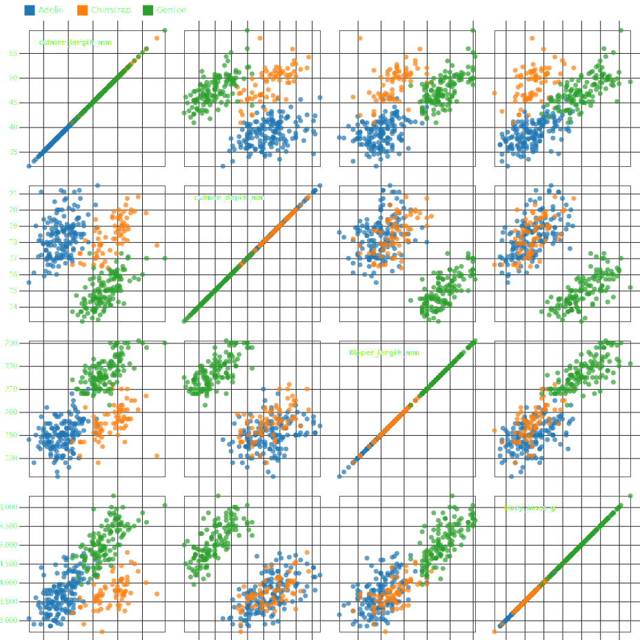

Scatter Matrix chart
====================

.. image:: ../figures/light-scatter-matrix.svg
   :align: center
   :class: only-light

1. Load data

.. code:: python

   # Source: https://observablehq.com/@d3/brushable-scatterplot-matrix
   import detroit as d3
   import polars as pl
   from operator import itemgetter, iadd
   from math import isnan, exp
   from itertools import product, accumulate

   URL = "https://static.observableusercontent.com/files/715db1223e067f00500780077febc6cebbdd90c151d3d78317c802732252052ab0e367039872ab9c77d6ef99e5f55a0724b35ddc898a1c99cb14c31a379af80a?response-content-disposition=attachment%3Bfilename*%3DUTF-8%27%27penguins.csv"

   # Load data
   penguins = pl.read_csv(URL)
   data = penguins.to_dicts()

.. code::

   shape: (344, 7)
   ┌─────────┬───────────┬──────────────────┬─────────────────┬───────────────────┬─────────────┬────────┐
   │ species ┆ island    ┆ culmen_length_mm ┆ culmen_depth_mm ┆ flipper_length_mm ┆ body_mass_g ┆ sex    │
   │ ---     ┆ ---       ┆ ---              ┆ ---             ┆ ---               ┆ ---         ┆ ---    │
   │ str     ┆ str       ┆ f64              ┆ f64             ┆ f64               ┆ f64         ┆ str    │
   ╞═════════╪═══════════╪══════════════════╪═════════════════╪═══════════════════╪═════════════╪════════╡
   │ Adelie  ┆ Torgersen ┆ 39.1             ┆ 18.7            ┆ 181.0             ┆ 3750.0      ┆ MALE   │
   │ Adelie  ┆ Torgersen ┆ 39.5             ┆ 17.4            ┆ 186.0             ┆ 3800.0      ┆ FEMALE │
   │ Adelie  ┆ Torgersen ┆ 40.3             ┆ 18.0            ┆ 195.0             ┆ 3250.0      ┆ FEMALE │
   │ Adelie  ┆ Torgersen ┆ NaN              ┆ NaN             ┆ NaN               ┆ NaN         ┆ null   │
   │ Adelie  ┆ Torgersen ┆ 36.7             ┆ 19.3            ┆ 193.0             ┆ 3450.0      ┆ FEMALE │
   │ …       ┆ …         ┆ …                ┆ …               ┆ …                 ┆ …           ┆ …      │
   │ Gentoo  ┆ Biscoe    ┆ NaN              ┆ NaN             ┆ NaN               ┆ NaN         ┆ null   │
   │ Gentoo  ┆ Biscoe    ┆ 46.8             ┆ 14.3            ┆ 215.0             ┆ 4850.0      ┆ FEMALE │
   │ Gentoo  ┆ Biscoe    ┆ 50.4             ┆ 15.7            ┆ 222.0             ┆ 5750.0      ┆ MALE   │
   │ Gentoo  ┆ Biscoe    ┆ 45.2             ┆ 14.8            ┆ 212.0             ┆ 5200.0      ┆ FEMALE │
   │ Gentoo  ┆ Biscoe    ┆ 49.9             ┆ 16.1            ┆ 213.0             ┆ 5400.0      ┆ MALE   │
   └─────────┴───────────┴──────────────────┴─────────────────┴───────────────────┴─────────────┴────────┘

2. Make the scatter chart

.. code:: python

   # Declare the chart dimensions.
   width = 928
   height = 928
   padding = 28
   columns = list(filter(lambda d: isinstance(data[0][d], float), penguins.columns))
   size = (width - (len(columns) + 1) * padding) / len(columns) + padding

   # Declare the legend dimensions.
   rect_size = 15
   legend_width = width
   legend_height = rect_size * 2

   # Create the SVG container.
   scatter = (
       d3.create("svg")
       .attr("width", width)
       .attr("height", height)
       .attr("viewBox", f"{-padding} 0 {width} {height}")
   )
   scatter.append("style").text(".circle.hidden{fill:#000;fill-opacity:1;r:1px;}")

   # Create the legend container.
   legend = scatter.append("g").attr(
       "transform", f"translate({rect_size / 2}, {rect_size / 2})"
   )

   svg = scatter.append("g").attr("transform", f"translate(0, {legend_height})")

   # Declare the x (horizontal position) scales.
   x = [
       d3.scale_linear()
       .set_domain(d3.extent(data, lambda d: d[c]))
       .set_range([padding / 2, size - padding / 2])
       for c in columns
   ]
   axis_x = d3.axis_bottom(None).set_ticks(6).set_tick_size(size * len(columns))

   # Declare the y (vertical position) scales.
   y = [scale.copy().set_range([size - padding / 2, padding / 2]) for scale in x]
   axis_y = d3.axis_left(None).set_ticks(6).set_tick_size(-size * len(columns))

   # Declare the color scale.
   color = (
       d3.scale_ordinal()
       .set_domain(list(map(itemgetter("species"), data)))
       .set_range(d3.SCHEME_CATEGORY_10)
   )

   # Function which add all x-axes, remove the domain lines, and add grid lines
   def x_axis(g):
       return (
           g.select_all("g")
           .data(x)
           .join("g")
           .attr("transform", lambda d, i: f"translate({i * size},0)")
           .each(lambda node, d, i, data: d3.select(node).call(axis_x.set_scale(d)))
           .call(lambda g: g.select(".domain").remove())
           .call(lambda g: g.select_all(".tick").select_all("line").attr("stroke", "#ddd"))
       )

   svg.append("g").call(x_axis)

   # Function which add all y-axes, remove the domain lines, and add grid lines
   def y_axis(g):
       return (
           g.select_all("g")
           .data(y)
           .join("g")
           .attr("transform", lambda d, i: f"translate(0,{i * size})")
           .each(lambda node, d, i, data: d3.select(node).call(axis_y.set_scale(d)))
           .call(lambda g: g.select(".domain").remove())
           .call(lambda g: g.select_all(".tick").select_all("line").attr("stroke", "#ddd"))
       )

   svg.append("g").call(y_axis)

   # Translate function for cells
   def transform(d):
       i, j = d
       return f"translate({i * size},{j * size})"

   # Make cells groups
   cell = (
       svg.append("g")
       .select_all("g")
       .data(product(range(len(columns)), range(len(columns))))
       .join("g")
       .attr("transform", transform)
   )

   # Make rectangles per cells
   (
       cell.append("rect")
       .attr("fill", "none")
       .attr("stroke", "#aaa")
       .attr("x", padding / 2 + 0.5)
       .attr("y", padding / 2 + 0.5)
       .attr("width", size - padding)
       .attr("height", size - padding)
   )

   # Function which adds circles in each cell
   def cell_callback(node, d, _1, _2):
       i, j = d
       (
           d3.select(node)
           .select_all("circle")
           .data(
               list(
                   filter(
                       lambda d: not (isnan(d[columns[i]])) and not (isnan(d[columns[j]])),
                       data,
                   )
               )
           )
           .join("circle")
           .attr("cx", lambda d: x[i](d[columns[i]]))
           .attr("cy", lambda d: y[j](d[columns[j]]))
           .attr("r", 3.5)
           .attr("fill-opacity", 0.7)
           .attr("fill", lambda d: color(d["species"]))
       )

   # Apply the cell function
   cell.each(cell_callback)

   # Add some texts in cells
   (
       svg.append("g")
       .style("font", "bold 10px sans-serif")
       .style("pointer-events", "none")
       .select_all("text")
       .data(columns)
       .join("text")
       .attr("transform", lambda d, i: f"translate({i * size},{i * size})")
       .attr("x", padding)
       .attr("y", padding)
       .attr("dy", ".71em")
       .text(lambda d: d)
   )

   # Legend part

   # Labels of the legend
   data = color.get_domain()

   # Function to clamp input between 0 and 1
   def clamp_total(total):
       def f(x):
           return 1 - exp(-x / total)

       return f

   offset_space = 80
   lengths = list(map(len, data))
   clamp = clamp_total(max(lengths))
   weights = list(map(clamp, lengths))
   w_max = max(weights)
   weights = [w / w_max for w in weights]  # normalize weights

   # Spaces between labels
   spaces = [0] + list(
       accumulate(
           map(lambda w: w * offset_space + rect_size, weights[:-1]),
           iadd,
       )
   )

   g = (
       legend.select_all("g")
       .data(data)
       .enter()
       .append("g")
       .attr("transform", lambda _, i: f"translate({spaces[i]}, 0)")
   )
   (
       g.append("rect")
       .attr("x", 0)
       .attr("y", 0)
       .attr("width", rect_size)
       .attr("height", rect_size)
       .attr("fill", lambda d: color(d))
       .attr("stroke", "none")
   )
   (
       g.append("text")
       .attr("x", rect_size + 5)
       .attr("y", rect_size * 0.75)
       .attr("fill", "black")
       .attr("stroke", "none")
       .attr("font-size", "0.75em")
       .text(lambda d: d)
   )

3. Save your chart

.. code:: python

   with open(f"scatter-matrix.svg", "w") as file:
       file.write(str(scatter))
