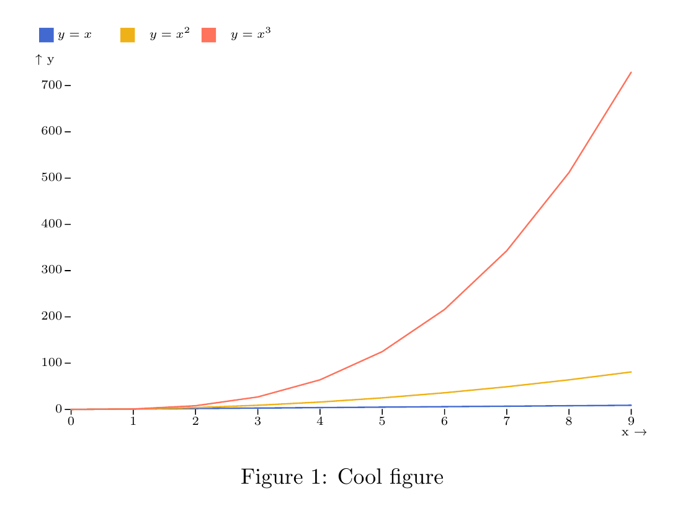

Export
======

SVG
---

One feature of :code:`detroit` is to export **completly** your visualization to :code:`.svg` file (not easily feasible with `Observable platform <https://observablehq.com/@observablehq>`_).

.. code::

   save(data, plot, "output.svg") # add grid argument for multiple plots

PNG
---

.. code::

   save(data, plot, "output.png", scale_factor=2) # add grid argument for multiple plots

:code:`scale_factor` controls the quality of the image.

PDF
---

.. code::

   save(data, plot, "output.pdf") # add grid argument for multiple plots

.. warning::

   The page layout of the PDF is not customizable or can not be changed.

Integration with LaTeX
----------------------

In order to have beautiful equations with your visualization, you must use `inkscape <https://inkscape.org/>`_.

First create your visualization :

.. code:: python

   from detroit import render, Data, Plot, js, save

   x = list(range(0, 10))
   values = [
       {
           "label": (f"$y = x^{i + 1}$" if i > 0 else "$y = x$"),
           "x": xi,
           "y": pow(xi, i + 1),
       }
       for i in range(3) for xi in x
   ]

   data = Data(values)

   plot = Plot.plot({
       "color": {"legend": js("true")},
       "marks": [
           Plot.lineY(data, {"x": "x", "y": "y", "stroke": "label"}),
       ]
   })

   save(data, plot, "figure.svg")

Then with the :code:`inkscape` command, you can create a :code:`.pdf_tex` file readable by LaTeX.

.. code:: shell

   inkscape -D figure.svg -o figure.pdf --export-latex

This command generates two files: :code:`figure.pdf` and :code:`figure.pdf_tex`.
Then you should change the font size of your SVG by the following command line :

.. code:: shell

   sed -i 's/\\\f@size/ 7.5/g' figure.pdf_tex

You can replace :code:`7.5` by another font size if you want.

You can finally generate a PDF by writing a :code:`.tex` file :

.. code:: tex

   \documentclass{article}
   \usepackage{graphicx}

   \begin{document}

   \begin{figure}[!ht]
     \centering
     \def\svgwidth{\columnwidth}
     \scalebox{0.8}{\input{figure.pdf_tex}}
     \caption{Cool figure}
   \end{figure}

   \end{document}

Then compile it :

.. code:: shell

   pdflatex file.tex

