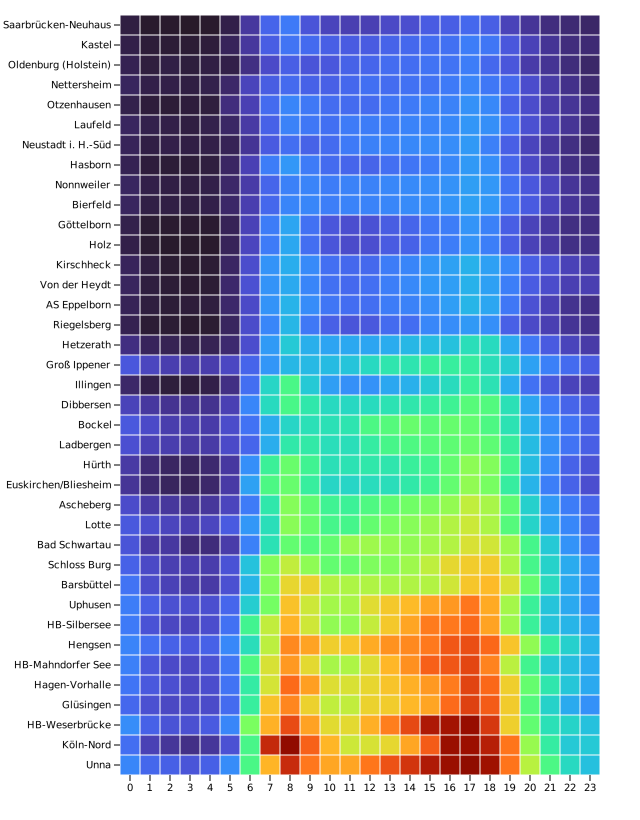
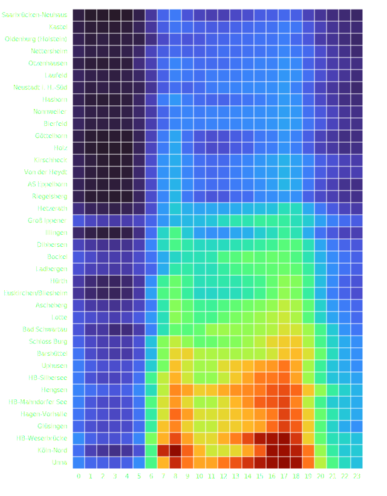

Heatmap
=======

1. Load data

.. code:: python

    from collections import namedtuple
    import detroit as d3
    import polars as pl

    URL = "https://static.observableusercontent.com/files/609a91fa3908394198a9b2592b8432a798332e9a140a8d5f9c864615e3f18b2e822badadc579c06b394bb1396a20f064d72123b718354b829978b2d4782bd5c9?response-content-disposition=attachment%3Bfilename*%3DUTF-8%27%27traffic.csv"

    Margin = namedtuple("Margin", ["top", "right", "bottom", "left"])

    theme = "light"

    # Extract hours and get the median of vehicles for each pair (location, hour)
    traffic = (
        (
            pl.read_csv(URL)
            .select(
                pl.col("location"),
                pl.col("date")
                .str.to_datetime("%Y-%m-%dT%H:%MZ", strict=False)
                .dt.hour()
                .alias("hour"),
                pl.col("vehicles"),
            )
            .fill_null(0)
        )
        .group_by("location", "hour")
        .agg(pl.col("vehicles").median())
    )

.. code::

   shape: (912, 3)
   ┌────────────────┬──────┬──────────┐
   │ location       ┆ hour ┆ vehicles │
   │ ---            ┆ ---  ┆ ---      │
   │ str            ┆ i8   ┆ f64      │
   ╞════════════════╪══════╪══════════╡
   │ Hasborn        ┆ 19   ┆ 929.0    │
   │ Köln-Nord      ┆ 13   ┆ 4762.0   │
   │ AS Eppelborn   ┆ 1    ┆ 91.0     │
   │ Köln-Nord      ┆ 7    ┆ 6882.0   │
   │ Hagen-Vorhalle ┆ 5    ┆ 1073.0   │
   │ …              ┆ …    ┆ …        │
   │ Von der Heydt  ┆ 5    ┆ 220.5    │
   │ Groß Ippener   ┆ 4    ┆ 473.0    │
   │ HB-Silbersee   ┆ 11   ┆ 3865.5   │
   │ Bad Schwartau  ┆ 2    ┆ 417.5    │
   │ Groß Ippener   ┆ 7    ┆ 1475.0   │
   └────────────────┴──────┴──────────┘

2. Make the line chart

.. code:: python

   data = traffic.to_dicts()

   width = 640
   height = 820

   margin = Margin(15, 40, 45, 120)

   # Declare the x (horizontal position) scale.
   x = d3.scale_band(list(map(str, range(24))), [margin.left, width - margin.right])

   # Declare the y (vertical position) scale.
   sorted_locations = (
       traffic.select(["location", "vehicles"])
       .sort("vehicles", descending=True)["location"]
       .unique(maintain_order=True)
       .to_list()
   )
   y = d3.scale_band(sorted_locations, [height - margin.bottom, margin.top])

   # Color scale for cell colors
   color = d3.scale_sequential([0, traffic["vehicles"].max()], d3.interpolate_turbo)

   svg = (
       d3.create("svg")
       .attr("width", width)
       .attr("height", height)
       .attr("viewBox", f"0 0 {width} {height}")
   )

   # Add the x-axis, remove the domain line.
   (
       svg.append("g")
       .attr("transform", f"translate(0, {height - margin.bottom})")
       .call(d3.axis_bottom(x))
       .call(lambda g: g.select(".domain").remove())
   )

   # Add the y-axis, remove the domain line.
   (
       svg.append("g")
       .attr("transform", f"translate({margin.left}, 0)")
       .call(d3.axis_left(y))
       .call(lambda g: g.select(".domain").remove())
   )

   # Add cells.
   (
       svg.append("g")
       .select_all()
       .data(data)
       .join("rect")
       .attr("x", lambda d: x(str(d["hour"])) + 0.5)
       .attr("y", lambda d: y(d["location"]) + 0.5)
       .attr("width", 19)
       .attr("height", 19)
       .attr("fill", lambda d: color(d["vehicles"]))
   )

3. Save your chart

.. code:: python

   with open(f"heatmap.svg", "w") as file:
       file.write(str(svg))
