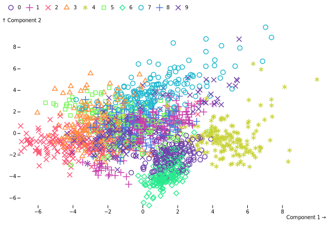
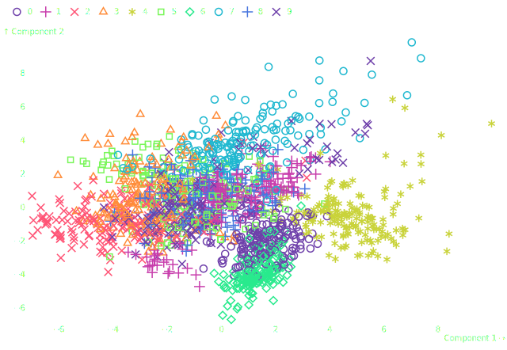

Detroit's documentation!
========================

:code:`detroit` is wrapper for Python of `d3js <https://d3js.org/>`_ and `Observable Plot <https://observablehq.com/plot/>`_.

Installation
------------

.. code:: shell

   pip install detroit

To have ..code::`jupyter`, you must add the following dependency :

.. code:: shell

   pip install detroit[jupyter]

Then you will need to install a browser through the Python package :code:`playwright`.
For the moment, only :code:`chromium` is supported.

.. code:: shell

  playwright install chromium

Features
--------

* Write as close as possible :code:`d3` and :code:`Plot` code
* Render one or multiple plots in your browser or in your jupyter notebook
* Save them into :code:`.svg`, :code:`.png` or :code:`.pdf`

Quick Example
-------------

.. code:: python

  import polars as pl
  from sklearn.datasets import load_digits
  from sklearn.decomposition import PCA
  from sklearn.preprocessing import StandardScaler

  from detroit import Plot, js, render, save

  mnsit = load_digits()
  scaler = StandardScaler()
  X_scaled = scaler.fit_transform(mnsit.data)
  pca = PCA(n_components=2)
  components = pca.fit_transform(X_scaled)

  # Prepare your data with Polars, Pandas or manually
  df = pl.DataFrame(components, schema=["Component 1", "Component 2"])
  df = df.insert_column(2, pl.Series("digit", mnsit.target))

  plot = Plot.plot({
      "style": {"backgroundColor": "#131416", "color": "white"},
      "symbol": {"legend": js("true")},
      "color": {"scheme": "rainbow"},
      "marks": [
          Plot.dot(js("data"), {
              "x": "Component 1",
              "y": "Component 2",
              "stroke": "digit",
              "symbol": "digit"
          })
      ]
  })

  render(df, plot, style={"body": {"background": "#131416", "color": "white"}})

.. toctree::
   :maxdepth: 2
   :caption: Contents:

   general
   d3
   plot
   style
   export
   api/index

Indices and tables
==================

* :ref:`genindex`
* :ref:`modindex`
* :ref:`search`
