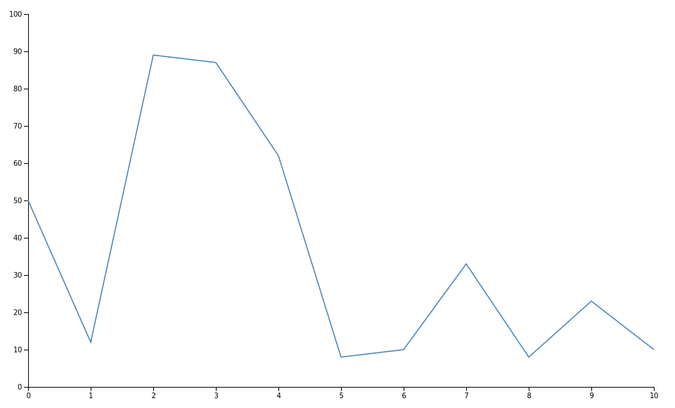
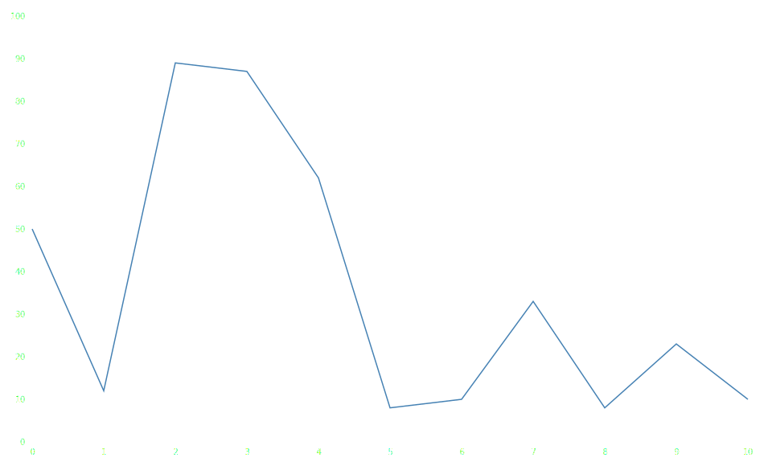

Detroit's documentation!
========================

:code:`detroit` is a Python implementation of `d3js <https://d3js.org/>`_.

Installation
------------

The latest stable version is `available on PyPI <https://pypi.org/project/detroit/>`_. Install with pip:

.. code:: shell

   pip install detroit

Getting starting
----------------

:code:`detroit` attempts to be as close as possible to the :code:`d3js` API.
Functions and methods has been renamed to be lowercase and seperated by underscores to follow the `PEP 8 conventions <https://peps.python.org/pep-0008/#function-and-variable-names>`_.
Instead of using the same method to *set* or *get* a value, most of classes has :code:`set_<property>` and :code:`get_<property>` methods. Here is an example:

.. code:: javascript

   // d3js
   const scale = d3.scaleLinear().domain([0, 10]).range([0, 920]);
   console.log(scale.domain()) // [0, 10]

.. code:: python

   # detroit
   scale = d3.scale_linear().set_domain([0, 10]).set_range([0, 920])
   print(scale.get_domain()) # [0, 10]

To create a :code:`svg` content, you cant start by using :code:`d3.create`:

.. code:: python

   import detroit as d3
   svg = d3.create("svg")

Then, you can create a scaler:

.. code:: python

   width = 960
   height = 580

   margin_left = 40
   margin_right = 30

   margin_top = 20
   margin_bottom = 30

   # Several signature accepted
   # d3.scale_linear()
   # d3.scale_linear(range)
   # d3.scale_linear(domain, range)
   x = d3.scale_linear([0, 10], [margin_left, width - margin_right])

   # or
   x = (
     d3.scale_linear()
     .set_domain([0, 10])
     .set_range([margin_left, width - margin_right])
   )

   y = d3.scale_linear([0, 100], [height - margin_bottom, margin_top])

Now, you can build your own visualization given your data:

.. code:: python

   data = [
      {"quantity": 0, "ratio": 50},
      {"quantity": 1, "ratio": 12},
      {"quantity": 2, "ratio": 89},
      {"quantity": 3, "ratio": 87},
      {"quantity": 4, "ratio": 62},
      {"quantity": 5, "ratio": 8},
      {"quantity": 6, "ratio": 10},
      {"quantity": 7, "ratio": 33},
      {"quantity": 8, "ratio": 8},
      {"quantity": 9, "ratio": 23},
      {"quantity": 10, "ratio": 10},
   ]

   # Add x axis
   (
       svg.append("g")
       .attr("class", "x-axis")
       .attr("transform", f"translate(0, {height - margin_bottom})")
       .call(d3.axis_bottom(x))
   )

   # Add y axis
   (
       svg.append("g")
       .attr("class", "y-axis")
       .attr("transform", f"translate({margin_left}, 0)")
       .call(d3.axis_left(y))
   )

   line = d3.line().x(lambda d: x(d["quantity"])).y(lambda d: y(d["ratio"]))

   # Add line path
   (
       svg.append("path")
       .attr("fill", "none")
       .attr("stroke", "steelblue")
       .attr("stroke-width", 1.5)
       .attr("d", line(data))
   )

Once you have finished, you can save it to a :code:`.svg` file:

.. code:: python

   with open("tuto.svg", "w") as file:
       file.write(str(svg))

Table of Content
----------------

.. toctree::
   :maxdepth: 2

   line
   area
   scatter
   bar
   histogram
   pie
   complex_charts/index
   api/index
