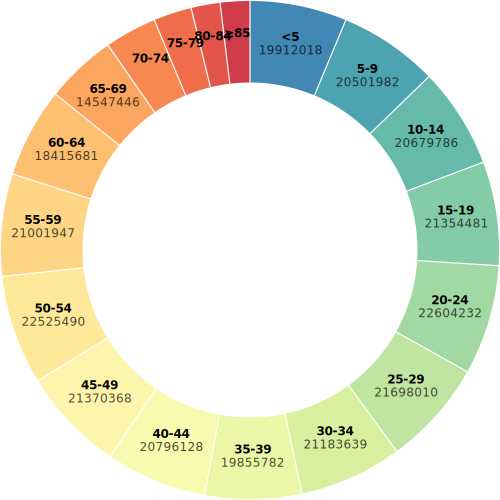
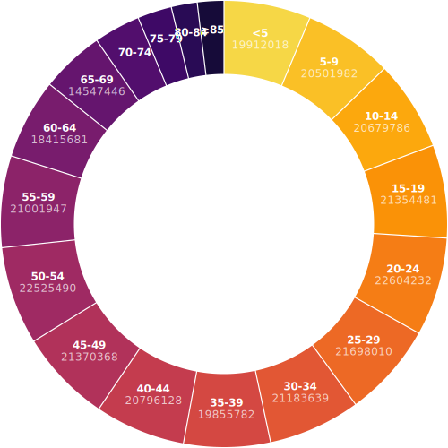

Pie chart
=========

1. Load data

.. code:: python

   # Source : https://observablehq.com/@d3/donut-chart/2
   import polars as pl # for data manipulation
   import detroit as d3

   URL = "https://static.observableusercontent.com/files/bee673b386dd058ab8d2cf353acbedc6aa01ebd1e6f63e2a9ab1b4273c7e6efd1eeea526345e4be7f0012d5db3ec743ef39ad9e6a043c196670bf9658cb02e79?response-content-disposition=attachment%3Bfilename*%3DUTF-8%27%27population-by-age.csv"

   data = pl.read_csv(URL)

.. code::

   shape: (18, 2)
   ┌───────┬──────────┐
   │ name  ┆ value    │
   │ ---   ┆ ---      │
   │ str   ┆ i64      │
   ╞═══════╪══════════╡
   │ <5    ┆ 19912018 │
   │ 5-9   ┆ 20501982 │
   │ 10-14 ┆ 20679786 │
   │ 15-19 ┆ 21354481 │
   │ 20-24 ┆ 22604232 │
   │ …     ┆ …        │
   │ 65-69 ┆ 14547446 │
   │ 70-74 ┆ 10587721 │
   │ 75-79 ┆ 7730129  │
   │ 80-84 ┆ 5811429  │
   │ ≥85   ┆ 5938752  │
   └───────┴──────────┘

2. Make the pie chart

.. code:: python

   # Declare the chart dimensions.
   width = 500
   height = min(width, 500)
   radius = min(width, height) / 2

   # Declare the arc generator with its dimensions.
   arc = d3.arc().set_inner_radius(radius * 0.67).set_outer_radius(radius - 1)

   # Declare pie generator with its dimensions.
   pie = d3.pie().set_pad_angle(1 / radius).set_sort(None).set_value(lambda d: d[1])

   # Declare color scale.
   color = (
       d3.scale_ordinal()
       .set_domain(data["name"].to_list())
       .set_range(
           d3.quantize(
               lambda t: d3.interpolate_spectral(t * 0.8 + 0.1),
               data.height,
           )[::-1]
       )
   )

   # Create the SVG container.
   svg = (
       d3.create("svg")
       .attr("width", width)
       .attr("height", height)
       .attr("viewBox", f"{-width / 2} {-height / 2} {width} {height}")
       .attr("style", "max-width: 100% height: auto;")
   )

   # Generate pies and add arcs to the chart.
   (
       svg.append("g")
       .select_all()
       .data(pie(data.iter_rows()))
       .join("path")
       .attr("fill", lambda d: color(d["data"][0]))
       .attr("d", arc)
       .append("title")
       .text(lambda d: f"{d['data'][0]}: {d['data'][1]}")
   )

   # Generate pies and add text on them.
   (
       svg.append("g")
       .attr("font-family", "sans-serif")
       .attr("font-size", 12)
       .attr("text-anchor", "middle")
       .select_all()
       .data(pie(data.iter_rows()))
       .join("g")
       # .attr("fill", "white") # white text
       .attr(
            "transform", lambda d: f"translate({arc.centroid(d)[0]}, {arc.centroid(d)[1]})"
       )
       .call(
           lambda g: (
               g.append("text")
               .append("tspan")
               .attr("y", "-0.4em")
               .attr("font-weight", "bold")
               .text(lambda d: d["data"][0])
           )
       )
       .call(
           lambda g: (
               g.filter(lambda d: (d["end_angle"] - d["start_angle"]) > 0.25)
               .select_all("text")
               .append("tspan")
               .attr("x", 0)
               .attr("y", "0.7em")
               .attr("fill-opacity", 0.7)
               .text(lambda d: str(d["data"][1]))
           )
       )
   )

3. Save your chart

.. code:: python

   with open("donut.svg", "w") as file:
       file.write(str(svg))
