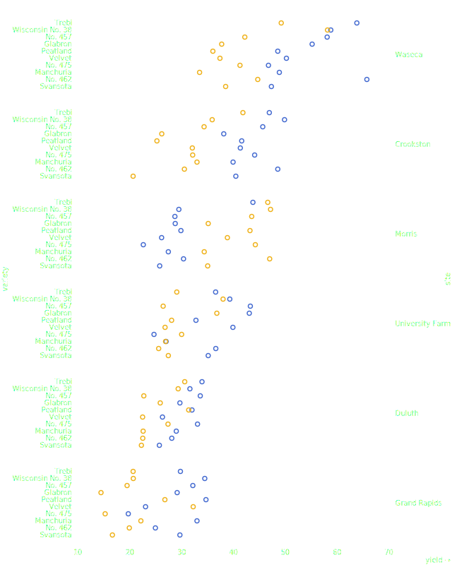
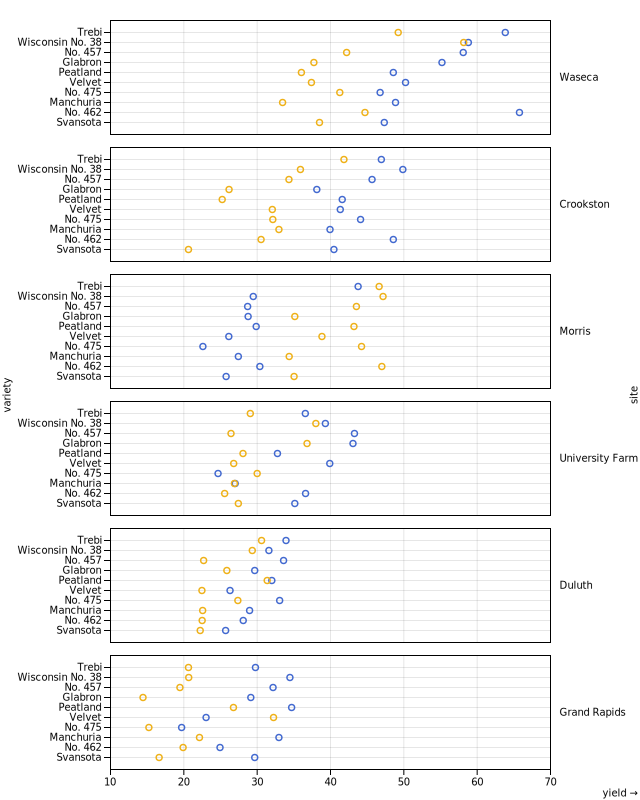
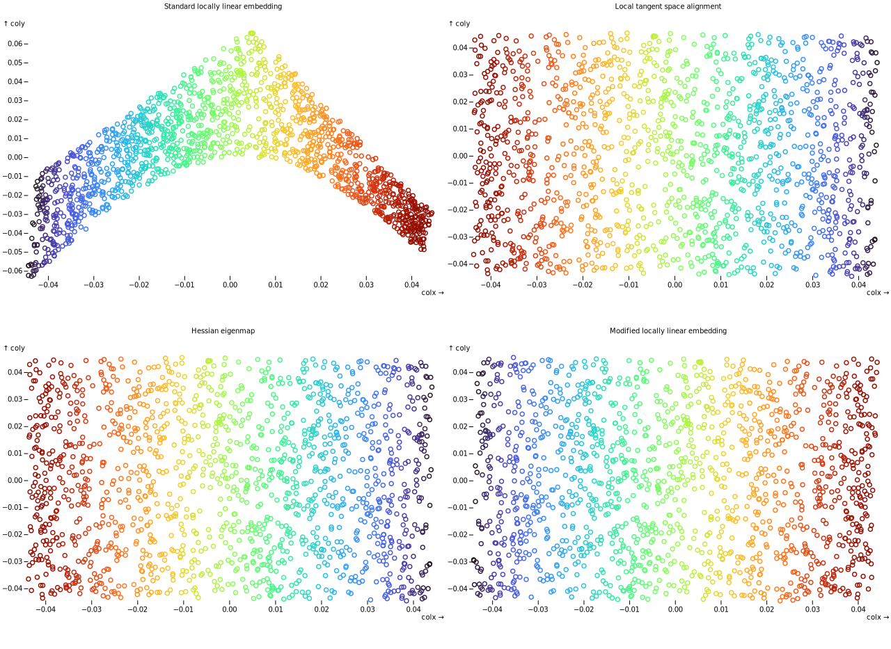
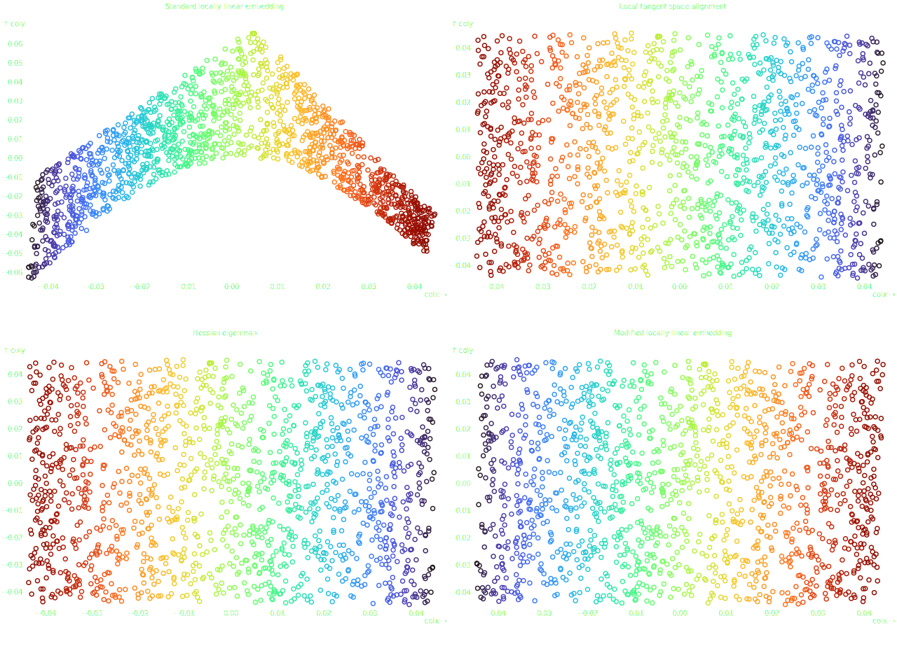

Plot Guide
==========

`Observable Plot <https://observablehq.com/plot/>`_ is a library written on top of `d3js <https://d3js.org/>`_ to simplify the number of lines of code needed to visualize a plot.

Syntax
------

`Observable Plot <https://observablehq.com/plot/>`_ presents a simple syntax easy to mimick with Python. With `detroit`, you can code :code:`Plot` easily.

There is only one main component to know : :code:`detroit.Plot` which is the main class for all :code:`Plot` functions.

Javascript code
***************

The `following example <https://observablehq.com/@observablehq/plot-barley-trellis>`_ has Javascript code that you will be able easily to write with Python :

.. code:: javascript

   // Javascript
   // Load data
   barley = FileAttachment("barley.csv").csv({typed: true})

   // Plot code
   Plot.plot({
     height: 800,
     marginRight: 90,
     marginLeft: 110,
     grid: true,
     x: {nice: true},
     y: {inset: 5},
     color: {type: "categorical"},
     marks: [
       Plot.frame(),
       Plot.dot(barley, {
         x: "yield",
         y: "variety",
         fy: "site",
         stroke: "year",
         sort: {y: "x", fy: "x", reduce: "median", reverse: true}
       })
     ]
   })

.. note::

  The **javascript** version needs also to setup `a HTML file where Plot is imported <https://observablehq.com/plot/getting-started#plot-in-vanilla-html>`_. Also, in order to load a json file in your browser, for security reasons, you have two options: write your code on a platform such as `Observable Plot <https://observablehq.com/plot/>`_ or use a javascript library such as `live-server <https://www.npmjs.com/package/live-server>`_ and the function :code:`d3.json` of the library `d3js <https://d3js.org/>`_ for example.

Python code
***********

With :code:`detroit`, you have almost the same syntax code :

.. code:: python

   from detroit import Plot, save
   from detroit import Data, js # useful classes to simplify js syntax
   from detroit import arrange  # simplify a DataFrame into an exploitable dictionary
   from detroit import render   # render the script in your browser
   import polars as pl          # or import pandas as pd

   # Load data
   df = pl.read_csv("barley.csv")
   barley = Data.arrange(df)

   true = js("true")

   plot = Plot.plot({
       "height": 800,
       "marginRight": 90,
       "marginLeft": 110,
       "grid": true,
       "x": {"nice": true},
       "y": {"inset": 5},
       "color": {"type": "categorical"},
       "marks": [
           Plot.frame(),
           Plot.dot(barley, {
            "x": "yield",
            "y": "variety",
            "fy": "site",
            "stroke": "year",
            "sort": {"y": "x", "fy": "x", "reduce": "median", "reverse": true}
           })
       ]
   })

   render(df, plot) # then open `localhost:5000` in your browser

Major modifications
*******************

* Data can be loaded directly from :code:`polars` or :code:`pandas`. The class :code:`Data` simplifies you the syntax to avoid :code:`js`. Note :code:`arrange` transforms dataframes into a dictionary for easy exploitation in next operations.

* In Python, :code:`True` has a capital at the beginning of the word whereas in javascript, :code:`true` does not. In order to have javascript syntax, :code:`js` allows you to write javascript code.

.. code:: python

  >>> print(["true"])
  ["true"]
  >>> print([js("true")])
  [true]

The main advantage is to remove quotes when a whole object is converted into a string.

Multiple Plots
--------------

For multiple visualizations, a list or a dictionary can be passed to :code:`render` function.

.. code:: python

   from detroit import Plot, js, render, save, style, Theme, arrange
   from sklearn import datasets, manifold
   import polars as pl

   nsamples = 1500
   spoints, scolors = datasets.make_s_curve(nsamples, random_state=0)

   params = {
      "n_neighbors": 12,
      "n_components": 2,
      "eigen_solver": "auto",
      "random_state": 0,
   }
   lle_methods = [
      ("Standard locally linear embedding", "standard"),
      ("Local tangent space alignment", "ltsa"),
      ("Hessian eigenmap", "hessian"),
      ("Modified locally linear embedding", "modified"),
   ]

   data = {}
   plots = {}
   for title, method in lle_methods:
       lle = manifold.LocallyLinearEmbedding(method=method, **params)
       points = lle.fit_transform(spoints)
       df = (
        # You can name columns as you want
        pl.from_numpy(points, schema=["colx", "coly"])
        .insert_column(2, pl.Series("color", scolors)
       )
       data[method] = arrange(df)
       # As long they correspond to "x": "my_column" and "y": "my_second_column"
       plots[title] = Plot.dot(
        js(f"data.{method}"),
        {"x": "colx", "y": "coly", "stroke": "color"}
       ).plot()

   render(data, plots, grid=2) # grid = number of columns

.. note::
   
   You can change the label of axis as you want. :code:`Plot` distinguishes *column names* with *labal names*. Check out the `documentation for more information <https://observablehq.com/plot/features/legends#legend-options>`_.

.. note::

   The font size of titles is small because :code:`.svg` files with :code:`detroit` are designed to be used with LaTeX.
