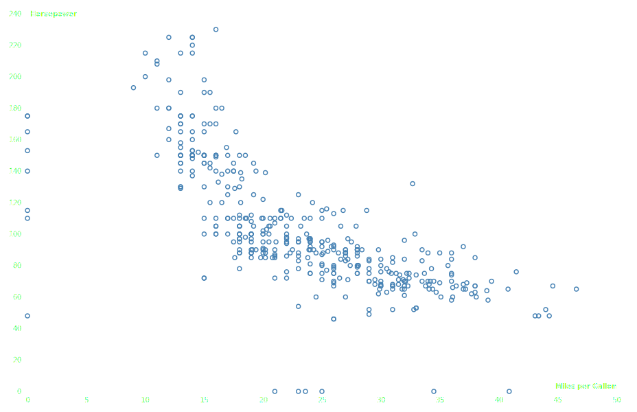

Scatter chart
=============

.. image:: figures/light-scatter.svg
   :align: center
   :class: only-light

1. Load data

.. code:: python

   # Source : https://observablehq.com/@d3/brushable-scatterplot
   import detroit as d3
   import polars as pl # for data manipulation
   from collections import namedtuple

   URL = "https://static.observableusercontent.com/files/53c407ee531bab128477148c9e28c49dd06bf83a93ae317e58dbb9fc819db0d4f6c4fb9646fa2fe20faad76addee20cfc360eab2362eeaec3340a5e4655b9996?response-content-disposition=attachment%3Bfilename*%3DUTF-8%27%27cars-2.csv"
   Margin = namedtuple("Margin", ["top", "right", "bottom", "left"])

   schema = pl.Schema(
       {
           "Name": pl.String,
           "Miles_per_Gallon": pl.Float32,
           "Cylinders": pl.Int32,
           "Displacement": pl.Float32,
           "Horsepower": pl.Int32,
           "Weight_in_lbs": pl.Int32,
           "Acceleration": pl.Float32,
           "Year": pl.Int32,
           "Origin": pl.String,
       }
   )
   cars = pl.read_csv(URL, schema=schema)

.. code::

   shape: (406, 9)
   ┌───────────────────────────┬──────────────────┬───────────┬──────────────┬───┬───────────────┬──────────────┬──────┬────────┐
   │ Name                      ┆ Miles_per_Gallon ┆ Cylinders ┆ Displacement ┆ … ┆ Weight_in_lbs ┆ Acceleration ┆ Year ┆ Origin │
   │ ---                       ┆ ---              ┆ ---       ┆ ---          ┆   ┆ ---           ┆ ---          ┆ ---  ┆ ---    │
   │ str                       ┆ f32              ┆ i32       ┆ f32          ┆   ┆ i32           ┆ f32          ┆ i32  ┆ str    │
   ╞═══════════════════════════╪══════════════════╪═══════════╪══════════════╪═══╪═══════════════╪══════════════╪══════╪════════╡
   │ chevrolet chevelle malibu ┆ 18.0             ┆ 8         ┆ 307.0        ┆ … ┆ 3504          ┆ 12.0         ┆ 1970 ┆ USA    │
   │ buick skylark 320         ┆ 15.0             ┆ 8         ┆ 350.0        ┆ … ┆ 3693          ┆ 11.5         ┆ 1970 ┆ USA    │
   │ plymouth satellite        ┆ 18.0             ┆ 8         ┆ 318.0        ┆ … ┆ 3436          ┆ 11.0         ┆ 1970 ┆ USA    │
   │ amc rebel sst             ┆ 16.0             ┆ 8         ┆ 304.0        ┆ … ┆ 3433          ┆ 12.0         ┆ 1970 ┆ USA    │
   │ ford torino               ┆ 17.0             ┆ 8         ┆ 302.0        ┆ … ┆ 3449          ┆ 10.5         ┆ 1970 ┆ USA    │
   │ …                         ┆ …                ┆ …         ┆ …            ┆ … ┆ …             ┆ …            ┆ …    ┆ …      │
   │ ford mustang gl           ┆ 27.0             ┆ 4         ┆ 140.0        ┆ … ┆ 2790          ┆ 15.6         ┆ 1982 ┆ USA    │
   │ vw pickup                 ┆ 44.0             ┆ 4         ┆ 97.0         ┆ … ┆ 2130          ┆ 24.6         ┆ 1982 ┆ Europe │
   │ dodge rampage             ┆ 32.0             ┆ 4         ┆ 135.0        ┆ … ┆ 2295          ┆ 11.6         ┆ 1982 ┆ USA    │
   │ ford ranger               ┆ 28.0             ┆ 4         ┆ 120.0        ┆ … ┆ 2625          ┆ 18.6         ┆ 1982 ┆ USA    │
   │ chevy s-10                ┆ 31.0             ┆ 4         ┆ 119.0        ┆ … ┆ 2720          ┆ 19.4         ┆ 1982 ┆ USA    │
   └───────────────────────────┴──────────────────┴───────────┴──────────────┴───┴───────────────┴──────────────┴──────┴────────┘

2. Make the scatter chart

.. code:: python

   # Specify the chart’s dimensions.
   width = 928
   height = 600
   margin = Margin(20, 30, 30, 40)

   # Create the horizontal (x) scale, positioning N/A values on the left margin.
   x = (
       d3.scale_linear()
       .set_domain([0, cars["Miles_per_Gallon"].max()])
       .nice()
       .set_range([margin.left, width - margin.right])
       .set_unknown(margin.left)
   )

   # Create the vertical (y) scale, positioning N/A values on the bottom margin.
   y = (
       d3.scale_linear()
       .set_domain([0, cars["Horsepower"].max()])
       .nice()
       .set_range([height - margin.bottom, margin.top])
       .set_unknown(height - margin.bottom)
   )

   # Create the SVG container.
   svg = (
       d3.create("svg")
       .attr("width", width)
       .attr("height", height)
       .attr("viewBox", f"0 0 {width} {height}")
   )

   # Append the axes.
   (
       svg.append("g")
       .attr("transform", f"translate(0, {height - margin.bottom})")
       .call(d3.axis_bottom(x))
       .call(lambda g: g.select(".domain").remove())
       .call(
           lambda g: g.append("text")
           .attr("x", width - margin.right)
           .attr("y", -4)
           .attr("fill", "#000")
           .attr("font-weight", "bold")
           .attr("text-anchor", "end")
           .text("Miles per Gallon")
       )
   )

   (
       svg.append("g")
       .attr("transform", f"translate({margin.left}, 0)")
       .call(d3.axis_left(y))
       .call(lambda g: g.select(".domain").remove())
       .call(
           lambda g: g.select(".tick:last-of-type").select("text").clone()
           .attr("x", 4)
           .attr("text-anchor", "start")
           .attr("font-weight", "bold")
           .text("Horsepower")
       )
   )

   # Append the dots.
   (
       svg.append("g")
       .attr("fill", "none")
       .attr("stroke", "steelblue")
       .attr("stroke-width", 1.5)
       .select_all("circle")
       .data(cars.iter_rows())
       .join("circle")
       .attr("transform", lambda d, i, data: f"translate({x(d[1])}, {y(d[4])})")
       .attr("r", 3)
   )

3. Save your chart

.. code:: python

   with open("scatter.svg", "w") as file:
       file.write(str(svg))
