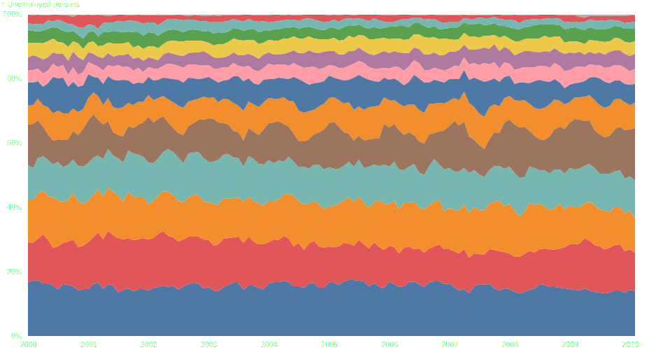

Stack chart
===========

.. image:: figures/light-stack-area.svg
   :align: center
   :class: only-light

1. Load data

.. code:: python

   # Source: https://observablehq.com/@d3/normalized-stacked-area-chart/2
   import polars as pl

   import detroit as d3

   URL = "https://static.observableusercontent.com/files/76f13741128340cc88798c0a0b7fa5a2df8370f57554000774ab8ee9ae785ffa2903010cad670d4939af3e9c17e5e18e7e05ed2b38b848ac2fc1a0066aa0005f?response-content-disposition=attachment%3Bfilename*%3DUTF-8%27%27unemployment.csv"

   unemployment = pl.read_csv(URL).select(
       pl.col("date").str.to_datetime("%Y-%m-%d"),
       pl.all().exclude("date"),
   )

.. code::

   shape: (1_708, 3)
   ┌─────────────────────┬──────────────────────────────┬────────────┐
   │ date                ┆ industry                     ┆ unemployed │
   │ ---                 ┆ ---                          ┆ ---        │
   │ datetime[μs]        ┆ str                          ┆ i64        │
   ╞═════════════════════╪══════════════════════════════╪════════════╡
   │ 2000-01-01 00:00:00 ┆ Wholesale and Retail Trade   ┆ 1000       │
   │ 2000-01-01 00:00:00 ┆ Manufacturing                ┆ 734        │
   │ 2000-01-01 00:00:00 ┆ Leisure and hospitality      ┆ 782        │
   │ 2000-01-01 00:00:00 ┆ Business services            ┆ 655        │
   │ 2000-01-01 00:00:00 ┆ Construction                 ┆ 745        │
   │ …                   ┆ …                            ┆ …          │
   │ 2010-02-01 00:00:00 ┆ Other                        ┆ 603        │
   │ 2010-02-01 00:00:00 ┆ Transportation and Utilities ┆ 591        │
   │ 2010-02-01 00:00:00 ┆ Information                  ┆ 300        │
   │ 2010-02-01 00:00:00 ┆ Agriculture                  ┆ 285        │
   │ 2010-02-01 00:00:00 ┆ Mining and Extraction        ┆ 79         │
   └─────────────────────┴──────────────────────────────┴────────────┘

2. Make the line chart

.. code:: python

   data = unemployment.to_dicts()

   # Declare chart's dimensions
   width = 928
   height = 500
   margin_top = 20
   margin_right = 20
   margin_bottom = 20
   margin_left = 40

   # Determine the series that need to be stacked.
   # set_keys: distinct series keys, in input order
   # set_values: get value for each series key and stack
   # index: group by stack then series key
   series = (
       d3.stack()
       .set_order(d3.stack_order_descending)
       .set_offset(d3.stack_offset_expand)
       .set_keys(unemployment["industry"].unique().to_list())
       .set_value(lambda d, key, i, data: data[d][key]["unemployed"])(
           d3.index(data, lambda d: d["date"], lambda d: d["industry"])
       )
   )

   # Prepare the scales for positional and color encodings.
   x = (
       d3.scale_time()
       .set_domain(d3.extent(data, lambda d: d["date"]))
       .set_range([margin_left, width - margin_right])
   )

   y = d3.scale_linear().set_range_round([height - margin_bottom, margin_top])

   color = (
       d3.scale_ordinal()
       .set_domain([d.key for d in series])
       .set_range(d3.SCHEME_TABLEAU_10)
   )

   # Construct an area shape.
   area = (
       d3.area()
       .x(lambda d: x(d.data.timestamp()))
       .y0(lambda d: y(d[0]))
       .y1(lambda d: y(d[1]))
   )

   # Create the SVG container.
   svg = (
       d3.create("svg")
       .attr("width", width)
       .attr("height", height)
       .attr("view_box", [0, 0, width, height])
       .attr("style", "max-width: 100% height: auto")
   )

   # Append a path for each series.
   (
       svg.append("g")
       .select_all()
       .data(series)
       .join("path")
       .attr("fill", lambda d: color(d.key))
       .attr("d", area)
       .append("title")
       .text(lambda d: d.key)
   )

   # Append the x axis, and remove the domain line.
   (
       svg.append("g")
       .attr("transform", f"translate(0, {height - margin_bottom})")
       .call(d3.axis_bottom(x).set_tick_size_outer(0))
       .call(lambda g: g.select(".domain").remove())
   )

   # Add the y axis, remove the domain line, add grid lines and a label.
   (
       svg.append("g")
       .attr("transform", f"translate({margin_left},0)")
       .call(d3.axis_left(y).set_ticks(height / 80, "%"))
       .call(lambda g: g.select(".domain").remove())
       .call(
           lambda g: g.select_all(".tick line")
           .filter(lambda d: d == 0 or d == 1)
           .clone()
           .attr("x2", width - margin_left - margin_right)
       )
       .call(
           lambda g: g.append("text")
           .attr("x", -margin_left)
           .attr("y", 10)
           .attr("fill", "currentColor")
           .attr("text-anchor", "start")
           .text("↑ Unemployed persons")
       )
   )

3. Save your chart

.. code:: python

   with open("stack-area.svg", "w") as file:
       file.write(str(svg))
