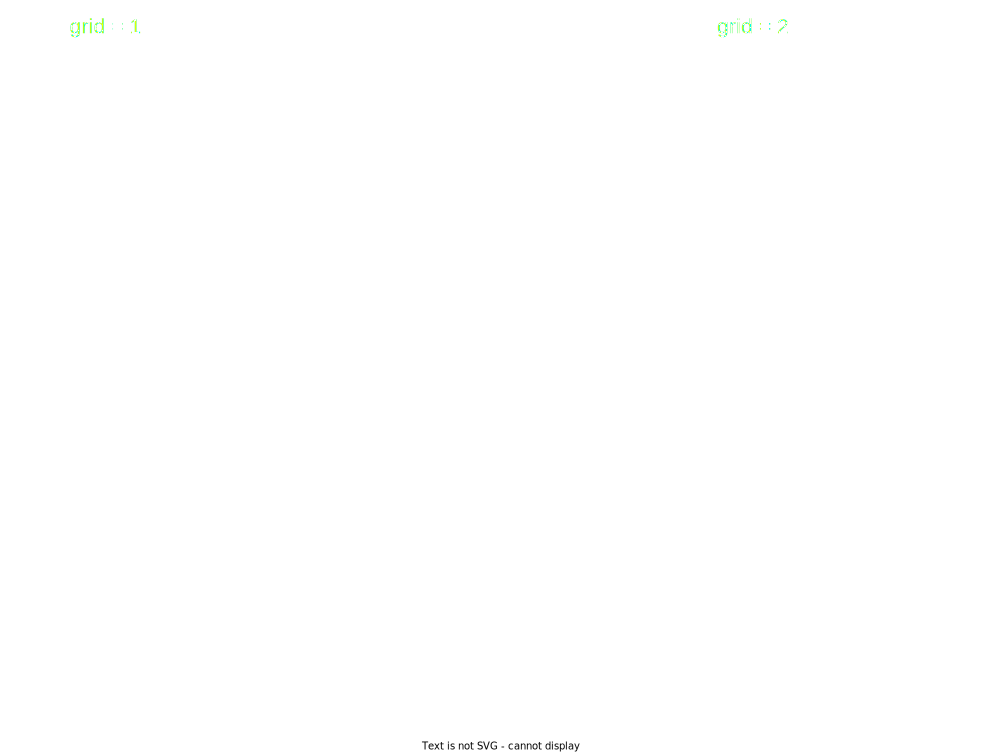

Style and multiple plots
========================

Style
-----

You can change easily the colors of your visualization as you want.
There are two arguments that you need to specify if you want to change :
- the visualization style (paths, lines, text, visualization background, ...)
- the general style (title, global background, ...)

With :code:`Plot`, it is easy, you need to specify only :code:`style` key in :code:`Plot.plot()`:

.. code:: python

   Plot.plot({
    "style": {"backgroundColor": "blue", "color": "red"},
    "marks": [
      ...
    ]
   })

.. note::

  There are some specific keywords such as :code:`backgroundColor`. It is always camelcase syntax. Thus by taking CSS style, you replace :code:`prefix-suffix` by :code:`prefixSuffix`.

With :code:`d3`, it is more complicated, you need to change the colors depending on how you build your visualization :

.. code:: python

   # It changes all axis and ticks into white color
   script( # change colors of axis lines
    svg.selectAll("path.domain").attr("stroke", "white")
   )
   script( # change tick color
    svg.selectAll("g.tick").selectAll("line").attr("stroke", "white")
   )
   script(
       svg.selectAll("g.tick") # change color of tick texts
       .selectAll("text")
       .attr("fill", "white")
       .attr("stroke", "none")
   )

   # Make a color scheme
   color = script(
       "color",
       d3.scaleLinear()
       .domain([max(values["allzeta"]), min(values["allzeta"])])
       .range(["gold", "deepskyblue"]),
   )

   # When generating lines, change color depending on key value
   script(
       svg.selectAll(".line")
       .data(data.allvalues)
       .enter()
       .append("path")
       .attr("fill", "none")
       .attr("stroke", js("d => color(d.key)")) # here
       .attr(
           "d",
           function("d")(
               d3.line()
                 .x(function("d")("x(d.x)"))
                 .y(function("d")("y(d.y)"))(js("d.values"))
           ),
       )
   )

For general style, your have several options :

Dictionary
**********

When you render your visualization, you can pass a dictionary :

.. code:: python

   render(data, plot, style={"body": {"background": "black", "color": "white"}})

File
****

You can write directly your style into a :code:`.css` file and pass it as argument :

In :code:`style.css` :

.. code:: css

   body {
    background: black;
    color: white;
   }

Then in your script :

.. code:: python

   render(data, plot, style="style.css")

String
******

If you don't want to have a separate file, you can also write it into a string :

.. code:: python

   style = """body {
    background: black;
    color: white;
   }
   """

   render(data, plot, style=style)

Multiple plots
--------------

By default, when you render or save :math:`n` plots, they are aligned into one column by :math:`n` rows.
:code:`grid` allows you to break the organization into :math:`m` columns.

Then you only need to indicate the argument :code:`grid` in :code:`render` or :code:`save` function.

.. code:: python

   render(data, multiple_plots, grid=2)
   save(data, multiple_plots, grid=2)
