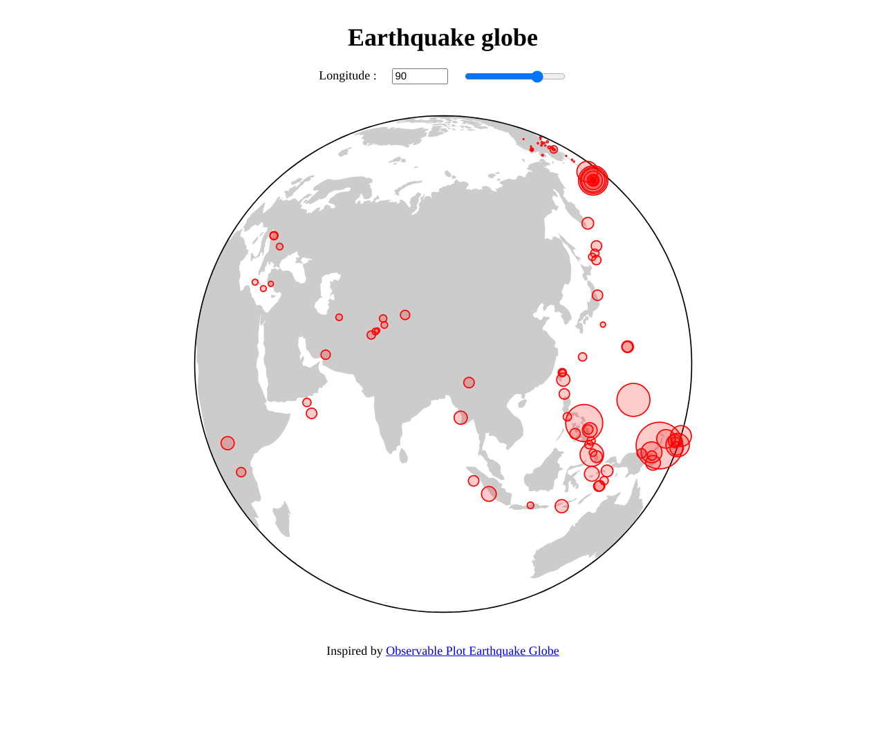

Templates
=========

:code:`detroit` helps you to code visualizations in Python. However, it is still better to code your visualizations in Javascript if you want to build a complete application.
You can follow `this example <https://github.com/bourbonut/detroit/tree/main/examples/template>`_ to build a template if you want or you need.

Structure
---------

First, you must have a structure like :

.. code::

  ├── script.py
  ├── static
  │   ├── figure.png
  │   ├── ...
  │   └── style.css
  └── templates
      ├── index.html
      └── template.js

Here, :code:`templates/main.js` is a Javascript template that we will use to generate Javascript code.

HTML template
-------------

First, we need to define a :code:`.html` template :

.. code:: html

  <!DOCTYPE>
  <html>
    <head>
      <link rel="stylesheet" href="{{ url_for('static', filename='style.css')}}">
      
      
      
    </head>
    <body>
      

        <h1>Earthquake globe</h1>
        
   
          Longitude :
          <input type="number" min="-180" max="180" value="90" step="1" name="number" id="longitude-number">
          <input type="range" min="-180" max="180" value="90" step="1" name="range" id="longitude-range">
        

        

        Inspired by <a href="https://observablehq.com/@observablehq/plot-earthquake-globe?intent=fork">Observable Plot Earthquake Globe</a>
      

      
    </body>
  </html>

In the :code:`<head>...</head>`, we create a URL to :code:`static/style.css` and we import Javascript scripts that we need later.
In the :code:`<body>...</body>`, we define the elements that we want to show, especially :code:`

` that will be filled later by our Javascript script.

Javascript template
-------------------

Next, we need to define a :code:`.js` template :

In :code:`main.py`, you can find :

.. code:: js

  // Global variable
  var cache = [];

  /////////////////////////////////////////////////////

  // Inputs functions
  document.querySelector("#longitude-number").oninput = function(){
    // Update values
    document.querySelector("#longitude-range").value = document.querySelector("#longitude-number").value;
    // Build the earth globe
    build(cache[0], cache[1]);
  }

  document.querySelector("#longitude-range").oninput = function(){
    // Update values
    document.querySelector("#longitude-number").value = document.querySelector("#longitude-range").value;
    // Build the earth globe
    build(cache[0], cache[1]);
  }

  /////////////////////////////////////////////////////

  // Fetch data one and save them to the cache variable
  async function fetchData(){
    const earthquakes = await d3.json("https://earthquake.usgs.gov/earthquakes/feed/v1.0/summary/2.5_week.geojson").then(d => d.features.map(f => {
      const c = d3.geoCentroid(f);
      return {magnitude: f.properties.mag, longitude: c[0], latitude: c[1]};
    }))

    const response = await fetch("{{ url }}");
    const world = await response.json();
    const land = topojson.feature(world, world.objects.land);
    cache = [earthquakes, land];
    build(earthquakes, land);
  }

  // Build the earth globe
  async function build(earthquakes, land) {
    const div = document.querySelector("#earth-globe"); // get div
    const longitude = document.querySelector("#longitude-range").value; // get longitude value
    const plot = {{ plot }}; // code from python
    if (div.innerHTML) {
      div.innerHTML = "";
      div.append(plot);
    } else {
      div.append(plot);
    } 
  }

  fetchData();

This code accepts two variables that will be built with Python :

.. code:: js

  async function fetchData(){
    // ...
    const response = await fetch("{{ url }}");
    // ...
  }

  async function build(earthquakes, land) {
    // ...
    const plot = {{ plot }}; // code from python
    // ...
  }

.. note::

   The code of these variable could be directly implemented without the need of Python.

Python script
-------------

Lastly, we need to make a server and complete our templates with Python :

.. code:: python

  from detroit import Plot, js
  from quart import Quart, render_template
  from jinja2 import FileSystemLoader, Environment, select_autoescape

  WORLD_URL = "https://static.observableusercontent.com/files/7c6167b65013c12f3978b4d8e85dd28a27e3b5eb580d1e76696ce5b0d399c196de2b02c45e734462931e1af823698e36bb072722253d5e03e7fb61222755bc0c"

  async def load_template(**variables):
      """
      Load "templates/main.js", change some variables, and save it into "static/main.js"
      """
      loader = FileSystemLoader("./templates")
      env = Environment(loader=loader, autoescape=select_autoescape(), enable_async=True)
      template = env.get_template("main.js")
      with open("static/main.js", "w") as file:
          file.write(await template.render_async(**variables))

  app = Quart(__name__)

  @app.route("/")
  async def main():
      plot = Plot.plot({
          "projection": {"type": "orthographic", "rotate": [js("-longitude"), -30]},
          "r": {"transform": js("(d) => Math.pow(10, d)")}, # convert Richter to amplitude
          "style": "overflow: visible;", # allow dots to escape
          "marks": [
              Plot.geo(js("land"), {"fill": "currentColor", "fillOpacity": 0.2}),
              Plot.sphere(),
              Plot.dot(js("earthquakes"), {"x": "longitude", "y": "latitude", "r": "magnitude", "stroke": "red", "fill": "red", "fillOpacity": 0.2})
          ]
      })
      await load_template(plot=str(plot), url=WORLD_URL)
      return await render_template("index.html")

  if __name__ == "__main__":
      app.run()

Variables are sent to :code:`templates/main.js` through the function :code:`load_template`.

Result
------

