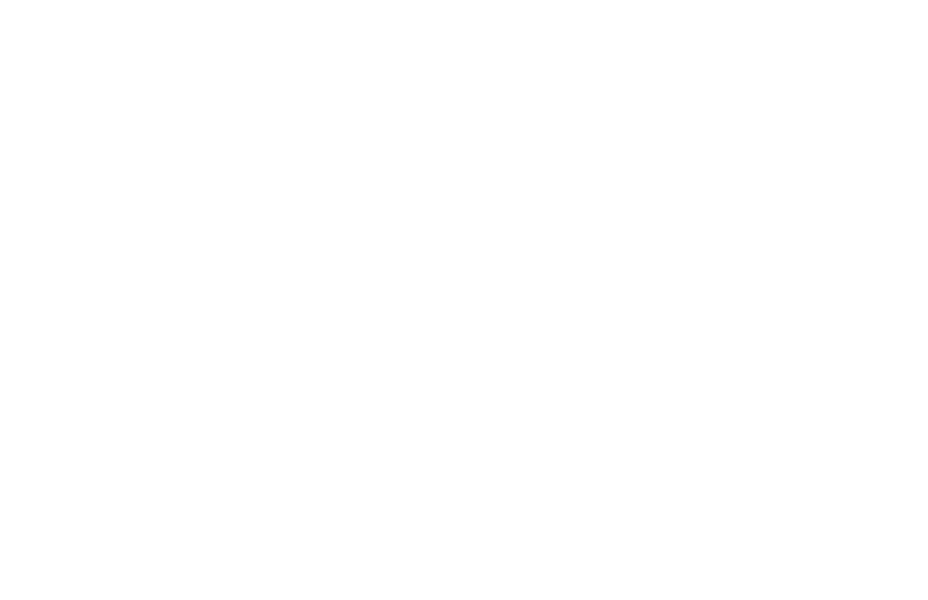

Voronoi diagram
===============

.. image:: figures/light-voronoi.svg
   :align: center
   :class: only-light

1. Load data

.. code:: python

   # Source: https://observablehq.com/@d3/voronoi-labels
   import detroit as d3
   from math import atan2, pi
   from random import normalvariate

   width = 928
   height = 600

   # Declare random functions to generate data coordinates
   def random_x():
       return normalvariate(width / 2, 80)

   def random_y():
       return normalvariate(height / 2, 80)

   data = [[random_x(), random_y()] for _ in range(200)]
   data = [d for d in data if 0 <= d[0] <= width and 0 <= d[1] <= height]

2. Make the voronoi diagram

.. code:: python

   # Group of static methods for orientating text (used later)
   class Orient:
       @staticmethod
       def top(text):
           return text.attr("text-anchor", "middle").attr("y", -6)

       @staticmethod
       def right(text):
           return text.attr("text-anchor", "start").attr("dy", "0.35em").attr("x", 6)

       @staticmethod
       def bottom(text):
           return text.attr("text-anchor", "middle").attr("dy", "0.71em").attr("y", 6)

       @staticmethod
       def left(text):
           return text.attr("text-anchor", "end").attr("dy", "0.35em").attr("x", -6)

   # Create delaunay triangulation and voronoi diagram
   delaunay = d3.Delaunay.from_points(data)
   voronoi = delaunay.voronoi([-1, -1, width + 1, height + 1])

   # Create a SVG container
   svg = (
       d3.create("svg")
       .attr("viewBox", [0, 0, width, height])
       .attr("width", width)
       .attr("height", height)
       .attr("style", "max-width: 100%; height: auto;")
   )

   # Convex closed polygons for voronoi diagram
   cells = [[d, voronoi.cell_polygon(i)] for i, d in enumerate(data)]

   # Lines for each cell from centroid to point
   def path(d):
       p, cell = d
       if cell is None:
           return ""
       centroid = d3.polygon_centroid(cell)
       return f"M{centroid[0]},{centroid[1]}L{p[0]},{p[1]}"

   (
       svg.append("g")
       .attr("stroke", "#3d94ff")
       .select_all("path")
       .data(cells)
       .join("path")
       .attr("d", path)
   )

   # Cells (all convex closed polygons)
   (
       svg.append("path")
       .attr("fill", "none")
       .attr("stroke", "#ccc")
       .attr("d", voronoi.render())
   )

   # Add points as a unique path (same as `data`)
   (
       svg.append("path")
       .attr("d", delaunay.render_points(None, 2))
   )

   # Function which adds text around points
   def each(node, d, i):
       p, cell = d
       x, y = p
       if cell is None:
           return
       cx, cy = d3.polygon_centroid(cell)
       angle = (round(atan2(cy - y, cx - x) / pi * 2) + 4) % 4

       match angle:
           case 0:
               call = Orient.right
           case 3:
               call = Orient.top
           case 1:
               call = Orient.bottom
           case _:
               call = Orient.left
       d3.select(node).call(call)

   # Turn on or off text given the polygon area
   def display(d):
       cell = d[1]
       if cell is None:
           return "none"
       if -d3.polygon_area(cell) > 2000:
           return ""
       else:
           return "none"

   # Add text into SVG container
   (
       svg.append("g")
       .style("font", "10px sans-serif")
       .select_all("text")
       .data(cells)
       .join("text")
       .each(each)
       .attr("transform", lambda d: f"translate({d[0][0]},{d[0][1]})")
       .attr("display", display)
       .text(lambda _, i: i)
   )

3. Save your chart

.. code:: python

   with open("voronoi.svg", "w") as file:
       file.write(str(svg))
