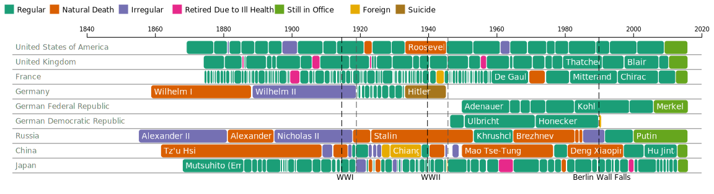
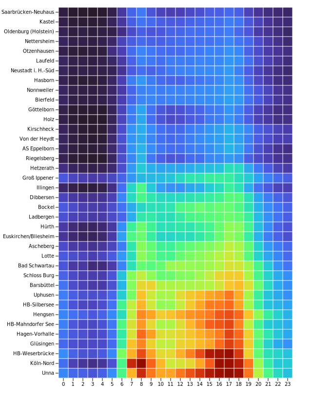
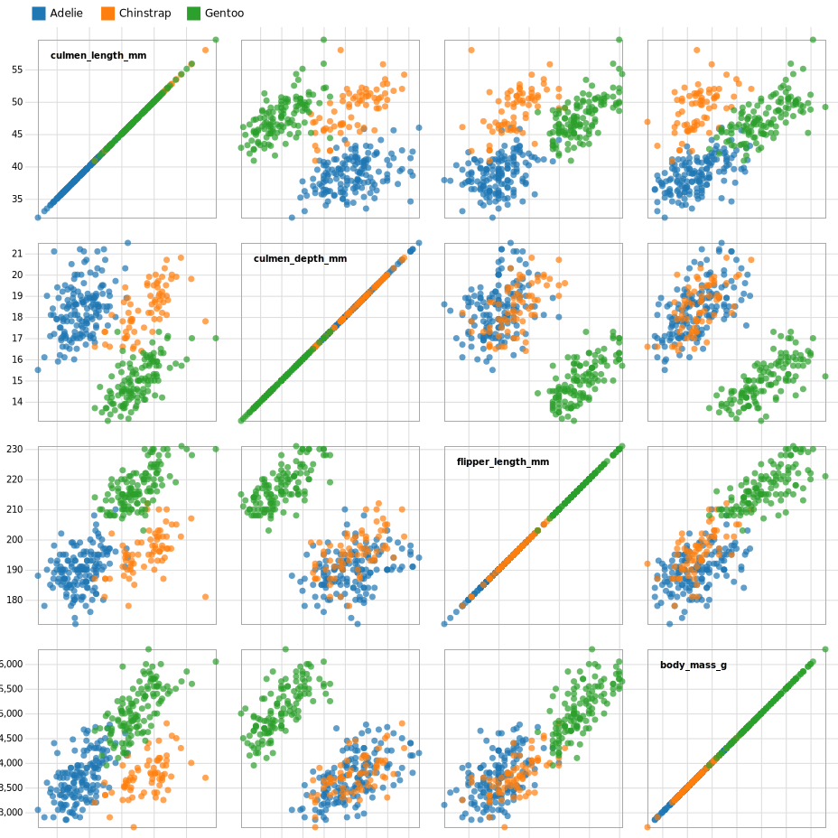
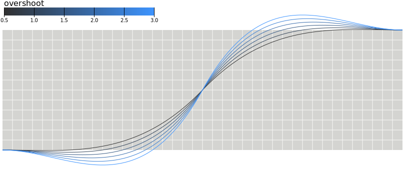
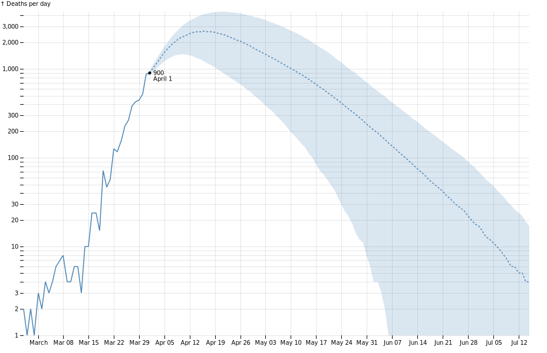
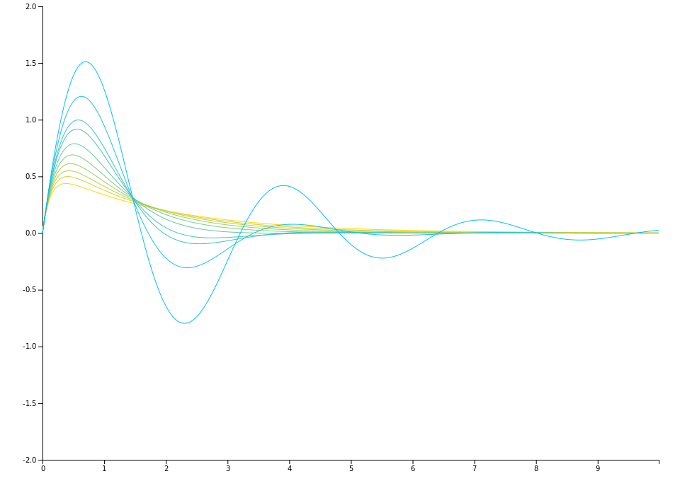
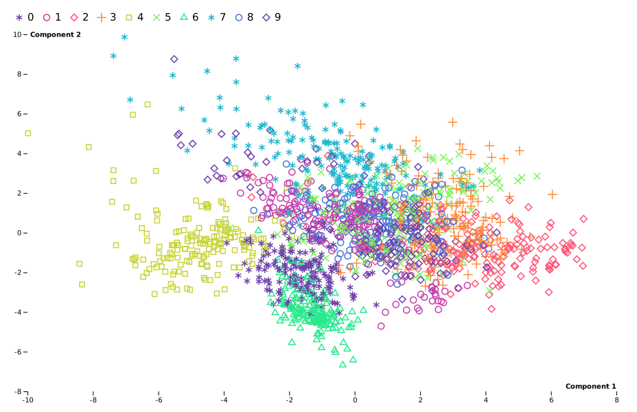

## Examples

> [!NOTE]
> Not all above examples are shown in this file.

### Projection example

    <picture >
        <source media="(prefers-color-scheme: dark)" srcset="../docs/source/figures/dark-projection-orthographic.png">
        <source media="(prefers-color-scheme: light)" srcset="../docs/source/figures/light-projection-orthographic.png">
        
    </picture>
     
    <a href="./all_projections.py">Source code</a>

### Chord example

    <picture >
        <source media="(prefers-color-scheme: dark)" srcset="../docs/source/figures/dark-chord.svg">
        <source media="(prefers-color-scheme: light)" srcset="../docs/source/figures/light-chord.svg">
        
    </picture>
     
    <a href="./chord.py">Source code</a>

### Gantt example

    <picture >
        <source media="(prefers-color-scheme: dark)" srcset="../docs/source/figures/dark-gantt.svg">
        <source media="(prefers-color-scheme: light)" srcset="../docs/source/figures/light-gantt.svg">
        
    </picture>
     
    <a href="./gantt.py">Source code</a>

### Kernel example

    <picture >
        <source media="(prefers-color-scheme: dark)" srcset="../docs/source/figures/dark_kernel_results.svg">
        <source media="(prefers-color-scheme: light)" srcset="../docs/source/figures/light_kernel_results.svg">
        
    </picture>
     
    <a href="./kernel_results.py">Source code</a>

### Continuous Schema example

    <picture >
        <source media="(prefers-color-scheme: dark)" srcset="../docs/source/figures/scheme_rainbow.png">
        <source media="(prefers-color-scheme: light)" srcset="../docs/source/figures/scheme_rainbow.png">
        
    </picture>
     
    <a href="./all_continuous_schemes.py">Source code</a>

### Stack example

    <picture >
        <source media="(prefers-color-scheme: dark)" srcset="../docs/source/figures/dark-stack-order-descending.svg">
        <source media="(prefers-color-scheme: light)" srcset="../docs/source/figures/light-stack-order-descending.svg">
        
    </picture>
     
    <a href="./all_stacks.py">Source code</a>

### Graticule example

    <picture >
        <source media="(prefers-color-scheme: dark)" srcset="../docs/source/figures/dark-graticule.svg">
        <source media="(prefers-color-scheme: light)" srcset="../docs/source/figures/light-graticule.svg">
        
    </picture>
     
    <a href="./graticule.py">Source code</a>

### Treemap example

    <picture >
        <source media="(prefers-color-scheme: dark)" srcset="../docs/source/figures/dark-treemap.svg">
        <source media="(prefers-color-scheme: light)" srcset="../docs/source/figures/light-treemap.svg">
        
    </picture>
     
    <a href="./treemap.py">Source code</a>

### Curve example

    <picture >
        <source media="(prefers-color-scheme: dark)" srcset="../docs/source/figures/dark_curve_cardinal_closed.svg">
        <source media="(prefers-color-scheme: light)" srcset="../docs/source/figures/light_curve_cardinal_closed.svg">
        
    </picture>
     
    <a href="./all_curves.py">Source code</a>

### Symbol example

    <picture >
        <source media="(prefers-color-scheme: dark)" srcset="../docs/source/figures/dark_symbols_fill.svg">
        <source media="(prefers-color-scheme: light)" srcset="../docs/source/figures/light_symbols_fill.svg">
        
    </picture>
     
    <a href="./all_symbols.py">Source code</a>

### Density example

    <picture >
        <source media="(prefers-color-scheme: dark)" srcset="../docs/source/figures/dark-density.svg">
        <source media="(prefers-color-scheme: light)" srcset="../docs/source/figures/light-density.svg">
        
    </picture>
     
    <a href="./density.py">Source code</a>

### Heatmap example

    <picture >
        <source media="(prefers-color-scheme: dark)" srcset="../docs/source/figures/dark-heatmap.svg">
        <source media="(prefers-color-scheme: light)" srcset="../docs/source/figures/light-heatmap.svg">
        
    </picture>
     
    <a href="./heatmap.py">Source code</a>

### Line example

    <picture >
        <source media="(prefers-color-scheme: dark)" srcset="../docs/source/figures/dark-line.svg">
        <source media="(prefers-color-scheme: light)" srcset="../docs/source/figures/light-line.svg">
        
    </picture>
     
    <a href="./line.py">Source code</a>

### Tree example

    <picture >
        <source media="(prefers-color-scheme: dark)" srcset="../docs/source/figures/dark-tree.svg">
        <source media="(prefers-color-scheme: light)" srcset="../docs/source/figures/light-tree.svg">
        
    </picture>
     
    <a href="./tree.py">Source code</a>

### Discrete Schema example

    <picture >
        <source media="(prefers-color-scheme: dark)" srcset="../docs/source/figures/discrete_scheme_spectral.png">
        <source media="(prefers-color-scheme: light)" srcset="../docs/source/figures/discrete_scheme_spectral.png">
        
    </picture>
     
    <a href="./all_discrete_schemes.py">Source code</a>

### Area example

    <picture >
        <source media="(prefers-color-scheme: dark)" srcset="../docs/source/figures/dark-area.svg">
        <source media="(prefers-color-scheme: light)" srcset="../docs/source/figures/light-area.svg">
        
    </picture>
     
    <a href="./area.py">Source code</a>

### Donut example

    <picture >
        <source media="(prefers-color-scheme: dark)" srcset="../docs/source/figures/dark-donut.svg">
        <source media="(prefers-color-scheme: light)" srcset="../docs/source/figures/light-donut.svg">
        
    </picture>
     
    <a href="./donut.py">Source code</a>

### Hertz Russel example

    <picture >
        <source media="(prefers-color-scheme: dark)" srcset="../docs/source/figures/hertz_russel.png">
        <source media="(prefers-color-scheme: light)" srcset="../docs/source/figures/hertz_russel.png">
        
    </picture>
     
    <a href="./hertz_russel.py">Source code</a>

### Pack example

    <picture >
        <source media="(prefers-color-scheme: dark)" srcset="../docs/source/figures/dark-pack.svg">
        <source media="(prefers-color-scheme: light)" srcset="../docs/source/figures/light-pack.svg">
        
    </picture>
     
    <a href="./pack.py">Source code</a>

### Scatter Matrix example

    <picture >
        <source media="(prefers-color-scheme: dark)" srcset="../docs/source/figures/dark-scatter-matrix.svg">
        <source media="(prefers-color-scheme: light)" srcset="../docs/source/figures/light-scatter-matrix.svg">
        
    </picture>
     
    <a href="./scatter_matrix.py">Source code</a>

### Voronoi example

    <picture >
        <source media="(prefers-color-scheme: dark)" srcset="../docs/source/figures/dark-voronoi.svg">
        <source media="(prefers-color-scheme: light)" srcset="../docs/source/figures/light-voronoi.svg">
        
    </picture>
     
    <a href="./voronoi_labels.py">Source code</a>

### Easing function example

    <picture >
        <source media="(prefers-color-scheme: dark)" srcset="../docs/source/figures/dark_ease_back_in_out.svg">
        <source media="(prefers-color-scheme: light)" srcset="../docs/source/figures/light_ease_back_in_out.svg">
        
    </picture>
     
    <a href="./all_easing_functions.py">Source code</a>

### Bar example

    <picture >
        <source media="(prefers-color-scheme: dark)" srcset="../docs/source/figures/dark-bar.svg">
        <source media="(prefers-color-scheme: light)" srcset="../docs/source/figures/light-bar.svg">
        
    </picture>
     
    <a href="./bar.py">Source code</a>

### Fan example

    <picture >
        <source media="(prefers-color-scheme: dark)" srcset="../docs/source/figures/dark-fan-chart.svg">
        <source media="(prefers-color-scheme: light)" srcset="../docs/source/figures/light-fan-chart.svg">
        
    </picture>
     
    <a href="./fan_chart.py">Source code</a>

### Histogram example

    <picture >
        <source media="(prefers-color-scheme: dark)" srcset="../docs/source/figures/dark-histogram.svg">
        <source media="(prefers-color-scheme: light)" srcset="../docs/source/figures/light-histogram.svg">
        
    </picture>
     
    <a href="./histogram.py">Source code</a>

### Scatter example

    <picture >
        <source media="(prefers-color-scheme: dark)" srcset="../docs/source/figures/dark-scatter.svg">
        <source media="(prefers-color-scheme: light)" srcset="../docs/source/figures/light-scatter.svg">
        
    </picture>
     
    <a href="./scatter.py">Source code</a>

### Bubble Map example

    <picture >
        <source media="(prefers-color-scheme: dark)" srcset="../docs/source/figures/dark-bubble-map.png">
        <source media="(prefers-color-scheme: light)" srcset="../docs/source/figures/light-bubble-map.png">
        
    </picture>
     
    <a href="./bubble_map.py">Source code</a>

### Impulse example

    <picture >
        <source media="(prefers-color-scheme: dark)" srcset="../docs/source/figures/dark-impulse.png">
        <source media="(prefers-color-scheme: light)" srcset="../docs/source/figures/light-impulse.png">
        
    </picture>
     
    <a href="./impulse.py">Source code</a>

### PCA example

    <picture >
        <source media="(prefers-color-scheme: dark)" srcset="../docs/source/figures/dark-pca.svg">
        <source media="(prefers-color-scheme: light)" srcset="../docs/source/figures/light-pca.svg">
        
    </picture>
     
    <a href="./pca.py">Source code</a>

### Stack Area example

    <picture >
        <source media="(prefers-color-scheme: dark)" srcset="../docs/source/figures/dark-stack-area.svg">
        <source media="(prefers-color-scheme: light)" srcset="../docs/source/figures/light-stack-area.svg">
        
    </picture>
     
    <a href="./stack_area.py">Source code</a>

